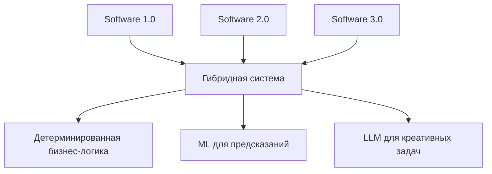

> [!abstract] Обзор парадигм
> Эволюция подходов к разработке программного обеспечения от жестко закодированных правил к системам, основанным на данных и интеллекте.

---

## 1. Что такое Software 1.0?
**Software 1.0** — это классический подход к программированию, где разработчик вручную пишет каждый алгоритм, правило и логику работы программы в виде явного кода (обычно на языках типа C++, Java, Python). Все поведение системы полностью определяется написанным кодом.

> [!note] Ключевая характеристика
> Человек → пишет правила → Компьютер выполняет

---

## 2. Назовите примеры Software 1.0.
- **Операционные системы** (Windows, Linux ядро)
- **Компиляторы и интерпретаторы** (GCC, Python интерпретатор)
- **Базы данных** (SQLite, PostgreSQL ядро)
- **Веб-серверы** (Apache, Nginx)
- **Офисные пакеты** (Microsoft Word, Excel)
- **Игры с предопределенной логикой** (Tetris, Pac-Man)

---

## 3. Почему Software 1.0 детерминирован?
Потому что его поведение **полностью определяется написанным кодом**. При одинаковых входных данных программа всегда производит одинаковый результат. Нет элементов случайности или обучения, которые могли бы изменить логику выполнения после написания кода.

```python
# Пример детерминированного кода
def add(a, b):
    return a + b  # Всегда одинаковый результат для одинаковых a и b
```

---

## 4. Какой главный компонент Software 1.0?
**Явно написанный код (алгоритмы и правила)**. Разработчик формулирует все возможные сценарии и реакции программы в виде инструкций.

---

## 5. Что такое Software 2.0?
**Software 2.0** — парадигма, где поведение программы определяется не явными правилами, а **моделями, обученными на данных**. Разработчик создает архитектуру модели и предоставляет данные, а система "учится" оптимальным правилам самостоятельно.

> [!note] Ключевая характеристика
> Данные → обучают модель → Модель принимает решения

---

## 6. Назовите примеры Software 2.0.
- **Системы распознавания изображений** (Face ID, автономные автомобили)
- **Машинный перевод** (Google Translate, DeepL)
- **Рекомендательные системы** (Netflix, Amazon, YouTube)
- **Голосовые помощники** (Siri, Alexa распознавание речи)
- **Предсказание текста** (автодополнение в Gmail, смарт-реплаи)

---

## 7. Назовите инструменты Software 2.0
- **Фреймворки для ML**: TensorFlow, PyTorch, Keras, Scikit-learn
- **Библиотеки для данных**: Pandas, NumPy, OpenCV
- **Платформы для развертывания**: MLflow, Kubeflow, AWS SageMaker
- **Специализированные языки**: Python (основной), R, Julia

---

## 8. Почему Software 2.0 не детерминирован?
- **Зависит от обучающих данных** (разные данные → разные модели)
- **Стохастичность в обучении** (случайная инициализация, dropout)
- **Аппроксимация, а не точные правила**
- **Может давать разные результаты на пограничных случаях**

---

## 9. Какой главный компонент Software 2.0?
**Обучающие данные и архитектура модели**. Качество и репрезентативность данных часто важнее качества кода.

---

## 10. Что такое Software 3.0?
**Software 3.0** — парадигма, где поведение системы определяется **крупными языковыми моделями (LLM) и промпт-инжинирингом**. Вместо обучения моделей с нуля или написания алгоритмов, разработчик использует готовые мощные модели, "направляя" их поведение с помощью промптов и контекста.

> [!note] Ключевая характеристика
> Промпты → направляют LLM → Интеллектуальное поведение

---

## 11. Назовите инструменты Software 3.0.
- **LLM API**: OpenAI GPT, Anthropic Claude, Google Gemini, Mistral
- **Фреймворки для промпт-инжиниринга**: LangChain, LlamaIndex, Semantic Kernel
- **Оркестраторы агентов**: AutoGen, CrewAI
- **Инструменты тонкой настройки**: LoRA, QLoRA, PEFT
- **Векторные базы данных**: Pinecone, Weaviate, Chroma

---

## 12. Какой главный компонент Software 3.0?
**Промпты, контекст и способность к рассуждению модели**. Умение формулировать задачи для LLM и управлять их выполнением становится ключевым навыком.

---

## 13. Является ли Software 3.0 предсказуемым?
**Нет, в традиционном смысле**. LLM являются стохастическими по своей природе:
- Зависит от температуры (temperature) sampling'а
- Может генерировать разные ответы на одинаковые промпты
- Склонен к "галлюцинациям" и генерации непроверенной информации
- Предсказуемость обеспечивается через системы валидации, цепочки мыслей и контекстное управление

---

## 14. Могут ли все парадигмы существовать вместе?
**Да, абсолютно**. Современные системы часто используют гибридный подход:



---

## 15. Как разработчик может использовать все три парадигмы в одном приложении?
**Пример: Умный финансовый помощник**

| Парадигма | Компонент приложения | Реализация |
|-----------|---------------------|------------|
| **Software 1.0** | Обработка транзакций, безопасность | Код на Python/Java для валидации платежей |
| **Software 2.0** | Предсказание рисков, рекомендации | ML модель для выявления мошенничества |
| **Software 3.0** | Консультации, генерация отчетов | GPT-4 для объяснения финансовых концепций |

---

## 16. Какой подход вы выберете для написания системы контроля доступа (логин/пароль) и почему?
**Software 1.0**, потому что:
- ✅ **Безопасность требует детерминизма** — одинаковые логин/пароль должны всегда давать одинаковый результат
- ✅ **Простота и надежность** — алгоритмы хеширования (bcrypt, Argon 2) хорошо изучены
- ✅ **Предсказуемость критична** — ошибки в аутентификации недопустимы
- ✅ **Низкие вычислительные затраты** — не требуется обучение моделей

> [!warning] Почему не другие?
> - Software 2.0: избыточно, нет паттернов для обучения
> - Software 3.0: риск безопасности, непредсказуемость

---

## 17. В чем главное отличие Software 1.0 от Software 2.0?
| Аспект | Software 1.0 | Software 2.0 |
|--------|--------------|--------------|
| **Основа** | Явные правила | Данные и обучение |
| **Детерминизм** | Полный | Частичный |
| **Сложность** | В коде | В данных |
| **Масштабируемость** | Линейно с кодом | Экспоненциально с данными |
| **Отладка** | По стеку вызовов | По метрикам модели |

---

## 18. Почему Software 1.0 плохо для распознавания паттернов?
- **Требует явного описания всех паттернов** — что невозможно для сложных данных (изображения, речь)
- **Хрупкость** — малейшие изменения во входных данных ломают правила
- **Экспоненциальная сложность** — количество правил растет экспоненциально с количеством признаков
- **Не обобщает** — не может обрабатывать паттерны, не описанные явно

---

## 19. Почему Software 2.0 хороша для больших данных?
- **Улучшается с данными** — больше данных → лучше модель
- **Автоматическое извлечение признаков** — не требует ручной инженерии признаков
- **Масштабируемость** — параллельная обработка больших датасетов
- **Обобщение** — может работать с данными, не виденными при обучении

---

## 20. Какая парадигма лучше для web-приложений?
**Зависит от компонента:**

| Компонент | Рекомендуемая парадигма | Причина |
|-----------|-------------------------|---------|
| **Бэкенд логика** | Software 1.0 | Детерминизм, надежность |
| **Рекомендации** | Software 2.0 | Персонализация на данных |
| **Чат-боты** | Software 3.0 | Естественный язык, креативность |
| **Аналитика** | Software 2.0 | Паттерны в данных |
| **UI/UX** | Software 1.0 + 3.0 | Стабильность + адаптивность |

---

## 21. Может ли Software 3.0 полностью заменить Software 1.0 для веб-приложений?
**Нет, по крайней мере сейчас**, потому что:

> [!danger] Критические ограничения LLM
> 1. **Надежность** — LLM могут "галлюцинировать" или давать противоречивые ответы
> 2. **Производительность** — инференс LLM дорог и медленнее традиционного кода
> 3. **Детерминизм** — критичен для финансовых, медицинских, безопасностных систем
> 4. **Прозрачность** — сложно отладить и понять, почему LLM принял решение
> 5. **Консистентность** — бизнес-логика должна работать одинаково для всех пользователей

---

## 22. Когда использование Software 3.0 может быть рискованным в production системе?
- **Финансовые операции** — ошибки стоят денег
- **Медицинские диагнозы** — ответственность за жизнь
- **Юридические консультации** — правовые последствия
- **Критическая инфраструктура** — энергосети, транспорт
- **Системы реального времени** — задержки инференса LLM
- **Сценарии без проверки человеком** — автономное принятие решений

---

## 23. Назовите один минус Software 3.0, который нельзя решить никаким prompting'ом
**Фундаментальная стохастичность и непредсказуемость генерации**. Даже с идеальным промптом:
- LLM могут генерировать разные ответы при одинаковых условиях
- Невозможно гарантировать 100% точность или соответствие требованиям
- Есть вероятность генерации вредоносного или неэтичного контента
- Модель может "забыть" инструкции в длинных контекстах

---

## 24. Дайте один пример Software 2.0 и один пример Software 3.0.
**Software 2.0**: *Система рекомендации товаров на Amazon*
- Обучается на истории покупок миллионов пользователей
- Использует collaborative filtering и deep learning модели
- Постоянно обновляется с новыми данными

**Software 3.0**: *GitHub Copilot*
- Использует Codex (специализированная LLM)
- Принимает промпты в виде комментариев и существующего кода
- Генерирует код, объяснения, тесты
- Работает как интеллектуальный ассистент разработчика

---

## 25. Почему Software 3.0 более универсален, чем Software 2.0?

| Критерий | Software 2.0 | Software 3.0 |
|----------|--------------|--------------|
| **Область применения** | Узкоспециализирована (одна задача) | Мультимодальна (текст, код, изображения) |
| **Порог входа** | Требует экспертизы в ML | Доступно с базовым промпт-инжинирингом |
| **Адаптивность** | Требует переобучения | Адаптируется через контекст и промпты |
| **Креативность** | Ограничена обучающими данными | Способна к нетривиальной генерации |
| **Рассуждения** | Статистические корреляции | Цепочки мыслей, логические выводы |

> [!success] Ключевое преимущество
> **Software 3.0 обладает emergent abilities** — способностями, не заложенными явно при обучении, но возникающими при масштабировании моделей.

---

> [!summary] Итоговые выводы
> 1. **Software 1.0** — фундамент, обеспечивающий надежность и детерминизм
> 2. **Software 2.0** — специалист по паттернам в больших данных  
> 3. **Software 3.0** — универсальный интеллектуальный инструмент
> 4. **Будущее** — в грамотной интеграции всех трех парадигм в зависимости от задачи
