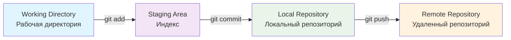
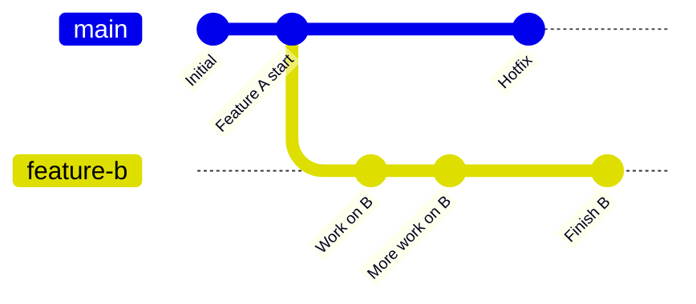
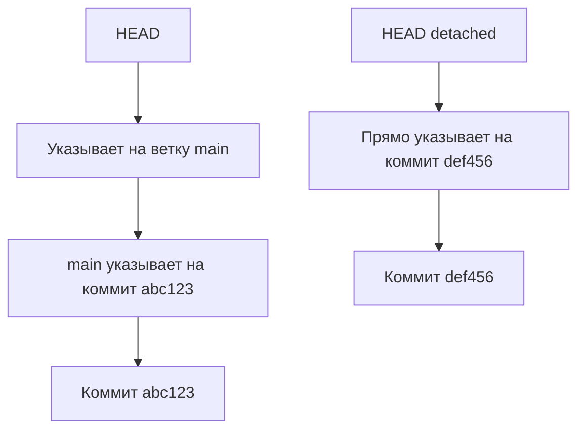
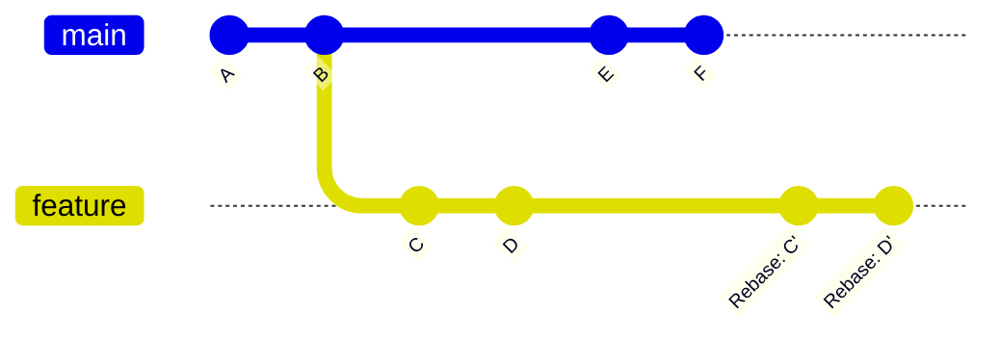
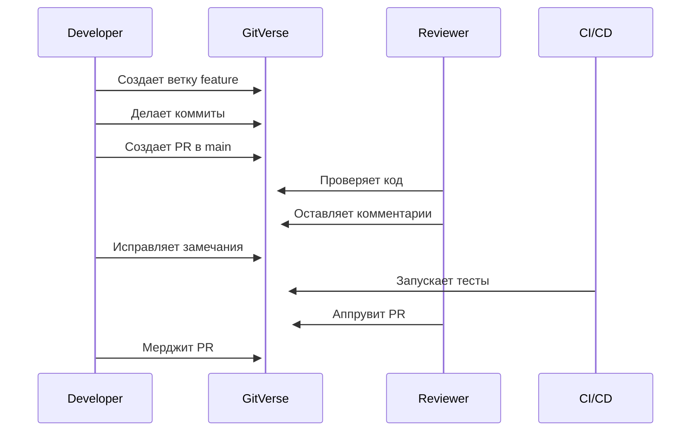

> [!abstract] Системы контроля версий и платформы для разработки
> Инструменты для управления исходным кодом, совместной работы и автоматизации процессов разработки.

---

## 1. Что такое Git?
**Git** — это распределенная система контроля версий (DVCS), созданная Линусом Торвальдсом в 2005 году. Git позволяет отслеживать изменения в исходном коде, координировать работу нескольких разработчиков и сохранять историю изменений проекта.

> [!note] Ключевые особенности Git
> - **Распределенная архитектура** — каждый разработчик имеет полную копию репозитория
> - **Скорость** — операции выполняются локально
> - **Целостность данных** — SHA-1 хеширование для всех объектов
> - **Ветвление** — легковесные и эффективные ветки

---

## 2. В чем разница между Git и GitHub?

| Аспект | **Git** | **GitHub** |
|--------|---------|------------|
| **Тип** | Инструмент/система | Веб-платформа/сервис |
| **Расположение** | Локальный (на компьютере) | Удаленный (в облаке) |
| **Основная функция** | Контроль версий | Хостинг репозиториев + коллаборация |
| **Доп. Возможности** | Командная строка | Issues, PR, Actions, Wiki, Pages |
| **Альтернативы** | Mercurial, SVN | GitLab, Bitbucket, GitVerse |

> [!tip] Аналогия
> Git — это *двигатель автомобиля* (основная технология), GitHub — это *автомобиль целиком* (продукт с интерфейсом).

---

## 3. Что такое GitVerse?
**GitVerse** — это современная платформа для управления исходным кодом и CI/CD, которая предоставляет расширенные возможности для командной работы, автоматизации и управления зависимостями. Часто позиционируется как более интегрированное решение по сравнению с традиционными Git-хостингами.

> [!note] Особенности GitVerse
> - Интеграция с контейнеризацией (Docker)
> - Встроенные инструменты для мониторинга кода
> - Расширенные возможности для CI/CD
> - Улучшенная визуализация зависимостей
> - Поддержка агентных систем и AI-ассистентов

---

## 4. В чем отличие GitVerse от GitHub с точки зрения разработчика?

| Критерий | **GitHub** | **GitVerse** |
|----------|------------|--------------|
| **Интерфейс** | Классический, проверенный | Современный, возможно экспериментальный |
| **Интеграции** | Огромная экосистема | Более специализированные, тесно интегрированные |
| **CI/CD** | GitHub Actions (YAML-based) | Встроенные пайплайны + расширенные возможности |
| **Мониторинг** | Basic insights, dependabot | Расширенная аналитика, AI-анализ кода |
| **Сообщество** | Крупнейшее в мире | Меньше, возможно более нишевое |
| **Целевая аудитория** | От OSS до корпораций | Современные стек-проекты, AI/ML команды |

---

## 5. Назовите три состояния файла в Git.



1. **Modified (Измененный)** — файл изменен в рабочей директории, но не добавлен в индекс
2. **Staged (Подготовленный)** — файл добавлен в индекс и готов к коммиту
3. **Committed (Зафиксированный)** — файл сохранен в локальной базе данных Git

---

## 6. Что делает `git add`?
`git add` перемещает изменения из **рабочей директории** в **staging area (индекс)**. Это команда подготовки изменений к коммиту.

```bash
# Добавить конкретный файл
git add filename.py

# Добавить все измененные файлы
git add .

# Добавить все файлы с определенным расширением
git add *.js

# Интерактивное добавление (выбор частей файлов)
git add -p
```

> [!warning] Важно
> `git add` не сохраняет изменения в репозитории — для этого нужен `git commit`.

---

## 7. Что делает `git commit`?
`git commit` создает постоянный снимок (снепшот) подготовленных изменений в **локальном репозитории**. Каждый коммит имеет:
- Уникальный хеш (SHA-1)
- Автора и коммиттера
- Сообщение коммита
- Указатель на родительский коммит

```bash
# Стандартный коммит с сообщением
git commit -m "Add user authentication feature"

# Коммит с открытием редактора для длинного сообщения
git commit

# Добавить и закоммитить за один шаг (только для уже отслеживаемых файлов)
git commit -am "Quick update"
```

---

## 8. Что делает `git status`?
`git status` показывает текущее состояние рабочей директории и индекса:

```bash
$ git status
On branch main
Your branch is up to date with 'origin/main'.

Changes to be committed:
  (use "git restore --staged <file>..." to unstage)
        modified:   README.md  # В staging area

Changes not staged for commit:
  (use "git add <file>..." to update what will be committed)
  (use "git restore <file>..." to discard changes in working directory)
        modified:   index.html  # В рабочей директории

Untracked files:
  (use "git add <file>..." to include in what will be committed)
        newfile.txt  # Новый, не отслеживаемый файл
```

---

## 9. Что такое ветка (branch)?
**Ветка (branch)** — это подвижный указатель на коммит, который позволяет вести изолированную разработку. Ветки в Git легковесны и дешевы в создании.



> [!tip] Аналогия
> Ветка — это *копия чертежа*, на которой можно экспериментировать, не затрагивая оригинал.

---

## 10. Когда вы должны создать новый branch вместо работы в main?
**Всегда, за исключением:**

✅ **Создавайте новую ветку когда:**
- Разрабатываете новую функциональность (feature branch)
- Исправляете баг (bugfix branch)
- Рефакторите код (refactor branch)
- Экспериментируете с новой технологией (experiment branch)
- Работаете в команде более 1 человека

❌ **Можно работать в main когда:**
- Делаете мелкие изменения в документации
- Исправляете опечатки в комментариях
- Обновляете README (хотя лучше и тут ветку)

> [!important] Золотое правило
> **main/master должен всегда оставаться стабильным и готовым к деплою.**

---

## 11. Что означает HEAD в Git?
**HEAD** — это указатель на текущий коммит в репозитории. Обычно HEAD указывает на последний коммит в текущей ветке.



**Два состояния HEAD:**
1. **Attached** — указывает на ветку (`HEAD → main → коммит`)
2. **Detached** — указывает напрямую на коммит (`HEAD → коммит`)

---

## 12. Объясните, в чем разница между `commit` и `push` в Git.

| Операция | Где выполняется | Что делает | Когда использовать |
|----------|----------------|------------|-------------------|
| **`commit`** | Локально | Сохраняет изменения в локальном репозитории | После завершения логического блока работы |
| **`push`** | С локального на удаленный | Отправляет коммиты на удаленный сервер | Когда готовы поделиться изменениями с командой |

```bash
# Локальный workflow
git add .           # Подготовить изменения
git commit -m "msg" # Сохранить локально
# ... можно делать много коммитов ...
git push            # Отправить на удаленный сервер
```

---

## 13. Объясните кратко, чем rebase отличается от merge.

| Аспект            | **Merge**                               | **Rebase**                             |
| ----------------- | --------------------------------------- | -------------------------------------- |
| **История**       | Сохраняет историю, создает merge commit | Переписывает историю, линейная история |
| **Подход**        | "Вливание" изменений                    | "Перемещение" коммитов                 |
| **Результат**     | Ветвистая история                       | Прямая линейная история                |
| **Безопасность**  | Безопаснее для публичных веток          | Опаснее (переписывает историю)         |
| **Использование** | Для интеграции feature веток            | Для поддержания чистой истории         |



> [!warning] Внимание с rebase!
> **Никогда не делайте rebase коммитов, которые уже были отправлены на удаленный сервер и использовались другими разработчиками.**

---

## 14. Что происходит при merge двух branches, которые изменили одну и ту же строку?
Возникает **merge conflict (конфликт слияния)**. Git не может автоматически определить, какое изменение должно остаться, и требует ручного разрешения конфликта.

```python
# В ветке main:
def calculate():
    return 2 + 2  # Было 2 + 2

# В ветке feature:
def calculate():
    return 3 * 3  # Изменили на 3 * 3

# При merge:
<<<<<<< HEAD
    return 2 + 2  # Версия из main
=======
    return 3 * 3  # Версия из feature
>>>>>>> feature
```

---

## 15. Что такое merge conflict?
**Merge conflict** — это ситуация, когда Git не может автоматически объединить изменения из двух веток, потому что они затрагивают одни и те же строки кода (или один файл был удален в одной ветке и изменен в другой).

**Типы конфликтов:**
1. **Содержательные конфликты** — изменения в одних и тех же строках
2. **Конфликты переименования** — файл переименован в одной ветке и изменен в другой
3. **Конфликты удаления** — файл удален в одной ветке и изменен в другой

---

## 16. Как разрешить merge conflict?

```bash
# 1. Узнать о конфликте
git merge feature-branch
# CONFLICT (content): Merge conflict in file.py

# 2. Проверить статус конфликтов
git status

# 3. Открыть файлы с конфликтами
# Файлы будут содержать маркеры:
# <<<<<<< HEAD (текущая ветка)
# ======= (разделитель)
# >>>>>>> feature-branch (вливаемая ветка)

# 4. Решить конфликт вручную
# Удалить маркеры и оставить нужный код

# 5. Добавить разрешенные файлы
git add resolved-file.py

# 6. Завершить merge
git commit  # Git создаст коммит слияния
```

> [!tip] Инструменты для разрешения конфликтов
> - VS Code (встроенный редактор конфликтов)
> - `git mergetool` (запускает внешний инструмент)
> - GitKraken, SourceTree (GUI-клиенты)

---

## 17. Как настроить branch protection в GitVerse, чтобы нельзя было push'ить напрямую в master?

```yaml
# Пример конфигурации защиты ветки в GitVerse
branch_protection:
  branch: "master"
  rules:
    - require_pull_request: true
      required_approvals: 2
      dismiss_stale_reviews: true
      require_code_owner_review: true
    
    - require_status_checks: true
      required_checks:
        - "build"
        - "test"
        - "lint"
      strict_status_checks: true
    
    - restrictions:
        push_access: false  # Запретить прямой push
        teams_can_push:
          - "release-managers"
    
    - require_linear_history: true
      allow_force_pushes: false
      allow_deletions: false
```

**Основные правила:**
- Требовать Pull Request для любых изменений
- Устанавливать обязательные аппрувы (минимум 1-2)
- Настраивать обязательные проверки CI/CD
- Запрещать force push и удаление ветки

---

## 18. Как создать новую ветку?

```bash
# Создать ветку и остаться в текущей
git branch new-feature

# Создать ветку и переключиться на нее
git checkout -b new-feature
# или
git switch -c new-feature  # Новый синтаксис Git 2.23+

# Создать ветку из определенного коммита
git branch new-feature abc123

# Создать ветку из другой ветки
git branch new-feature origin/develop

# Создать ветку и сразу отправить на удаленный сервер
git push -u origin new-feature
```

---

## 19. Когда удаление веток (branches) актуально и зачем?

✅ **Удалять ветки когда:**
- **Слияние завершено** — ветка влита в main/develop
- **Эксперимент завершен** — даже если не влили
- **Ветка устарела** — неактуальная функциональность
- **Очистка перед релизом** — уменьшение clutter'а

❌ **Не удалять когда:**
- **Ветка используется другими** — проверьте перед удалением
- **Нужна для hotfix'ов** — релизные ветки иногда оставляют
- **Длинноживущие ветки** — develop, staging, production

```bash
# Удалить локальную ветку (если она уже слита)
git branch -d feature-branch  # Безопасное удаление
git branch -D feature-branch  # Принудительное удаление

# Удалить удаленную ветку
Git push origin --delete feature-branch
```

---

## 20. Как переключиться на другую ветку?

```bash
# Классический способ
Git checkout branch-name

# Новый способ (Git 2.23+)
Git switch branch-name

# Создать и переключиться
Git checkout -b new-branch
Git switch -c new-branch

# Переключиться на предыдущую ветку
Git checkout -
Git switch -

# Переключиться на ветку с удаленного сервера
Git checkout --track origin/remote-branch
```

> [!note] Разница между checkout и switch
> `git checkout` — многофункциональная команда (переключение, создание, восстановление файлов)
> `git switch` — специализированная только для переключения веток (менее запутанная)

---

## 21. Что такое pull request (PR)?
**Pull Request (PR)** — это механизм в системах типа GitHub/GitVerse для предложения изменений из одной ветки в другую. PR включает:
- Список изменений (коммитов)
- Описание изменений
- Обсуждение кода
- Code review
- CI/CD проверки
- Возможность мерджа после аппрувов



---

## 22. Почему Pull Request важен при работе в команде?

1. **Code Quality** — двойная проверка кода перед мерджем
2. **Knowledge Sharing** — разработчики учатся друг у друга
3. **Consistency** — соблюдение стандартов кодирования
4. **Early Bug Detection** — нахождение ошибок до продакшена
5. **Documentation** — история обсуждений и решений
6. **Ownership** — коллективная ответственность за код
7. **Learning Tool** — особенно для junior разработчиков

> [!quote] "Четыре глаза видят больше, чем два"
> Code review через PR — это самая эффективная практика для улучшения качества кода.

---

## 23. Кто может быть reviewer при code review и почему важно разнообразие reviewers?

**Кто может быть reviewer:**
- **Разработчики той же команды** — понимают контекст
- **Tech Lead/Architect** — стратегическое видение
- **Разработчики смежных команд** — интеграционный взгляд
- **QA инженеры** — фокус на тестируемость
- **Security специалисты** — проверка на уязвимости
- **Junior разработчики** — для обучения и свежего взгляда

**Почему важно разнообразие:**
- **Разные перспективы** — фронтенд/бэкенд/девопс взгляд
- **Предотвращение слепых зон** — каждый видит свои риски
- **Распределение знаний** — информация не застревает у одного
- **Меньше bias** — избегание "группового мышления"
- **Обучение и менторинг** — младшие учатся у старших

---

## 24. Что такое `. Gitignore` и какие файлы обычно в нем указывают?
**`. Gitignore`** — это специальный файл в Git, который указывает, какие файлы и директории должны игнорироваться системой контроля версий.

```gitignore
# Пример .gitignore файла

# Зависимости
/node_modules/
/vendor/
/. Venv/
/__pycache__/

# Среда разработки
/. Idea/
/. Vscode/
*. Swp
*. Swo

# Сборки и артефакты
/build/
/dist/
/*. Exe
/*. App

# Конфигурационные файлы с секретами
.env
*. Key
*. Pem

# Логи
*. Log
Logs/

# Системные файлы
.DS_Store
Thumbs. Db
```

---

## 25. Назовите типичные файлы в `. Gitignore`.

**Категория 1: Зависимости и артефакты сборки**
```gitignore
Node_modules/          # npm зависимости
Vendor/               # Composer (PHP)
__pycache__/          # Python кэш
*. Class               # Java байткод
/target/              # Maven сборки
/dist/                # Скомпилированные файлы
```

**Категория 2: Файлы IDE и редакторов**
```gitignore
.idea/                # JetBrains IDE
.vscode/              # VS Code (кроме extensions. Json)
*. Swp                 # Vim swap файлы
.project              # Eclipse
```

**Категория 3: Конфигурация и секреты**
```gitignore
.env                  # Переменные окружения
.env. Local            # Локальные настройки
*. Key                 # Криптографические ключи
Config/secrets. Yml    # Файлы с паролями
```

**Категория 4: Системные файлы**
```gitignore
.DS_Store            # macOS
Thumbs. Db            # Windows
Desktop. Ini          # Windows
```

**Категория 5: Логи и временные файлы**
```gitignore
*. Log                # Логи приложений
Npm-debug. Log*       
Yarn-debug. Log*
Tmp/                 # Временные файлы
```

> [!tip] Генераторы .gitignore
> Используйте [gitignore.io](https://www.toptal.com/developers/gitignore) для автоматической генерации `. Gitignore` под ваш стек технологий.

---

> [!summary] Итоговые выводы
> 1. **Git** — мощный инструмент для контроля версий с распределенной архитектурой
> 2. **GitVerse/GitHub** — платформы для коллаборации поверх Git
> 3. **Ветвление** — ключевая концепция для изолированной разработки
> 4. **Pull Requests** — основа современной командной работы
> 5. **`. Gitignore`** — критически важный файл для чистоты репозитория