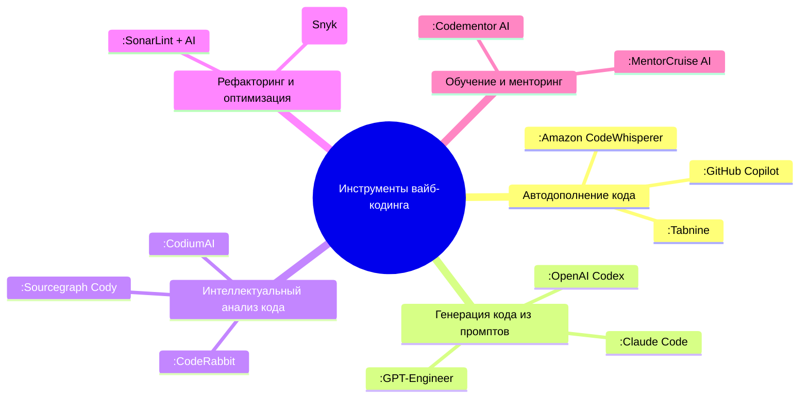
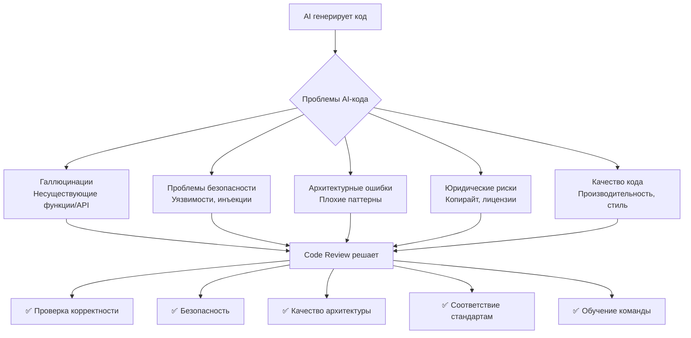
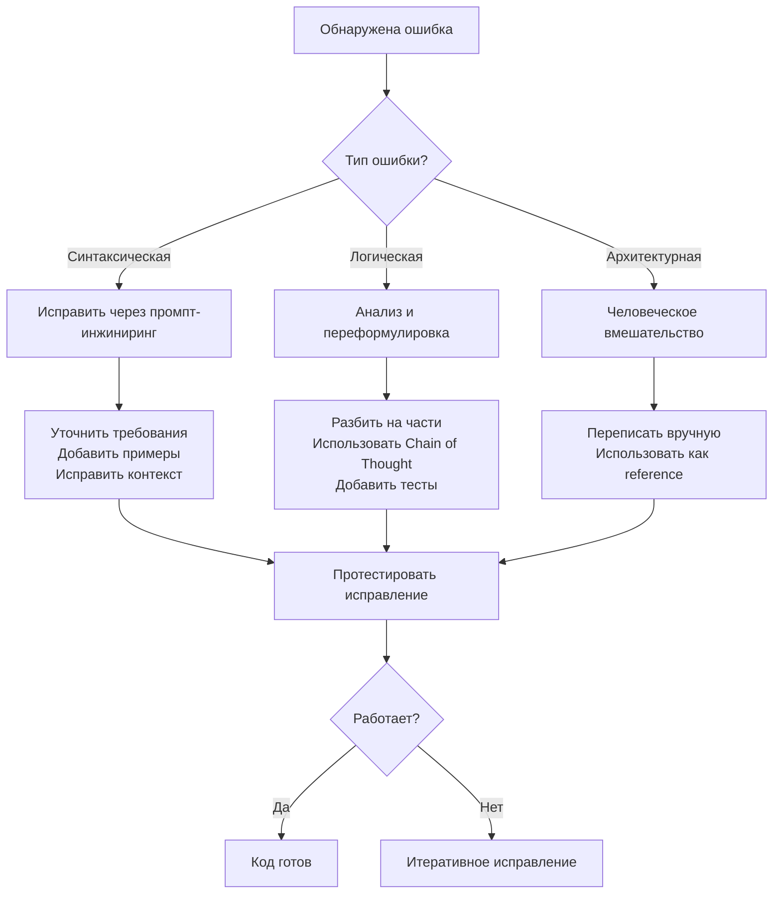
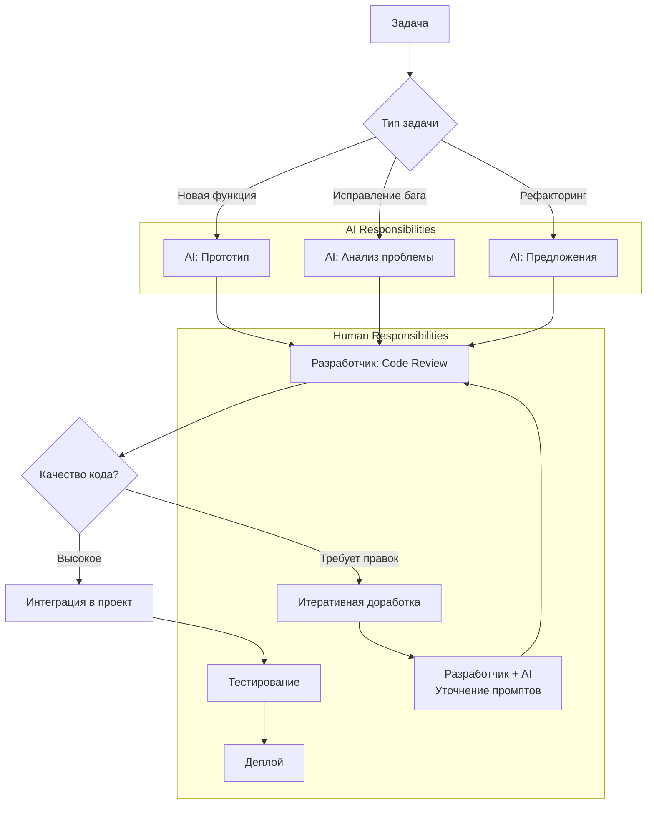
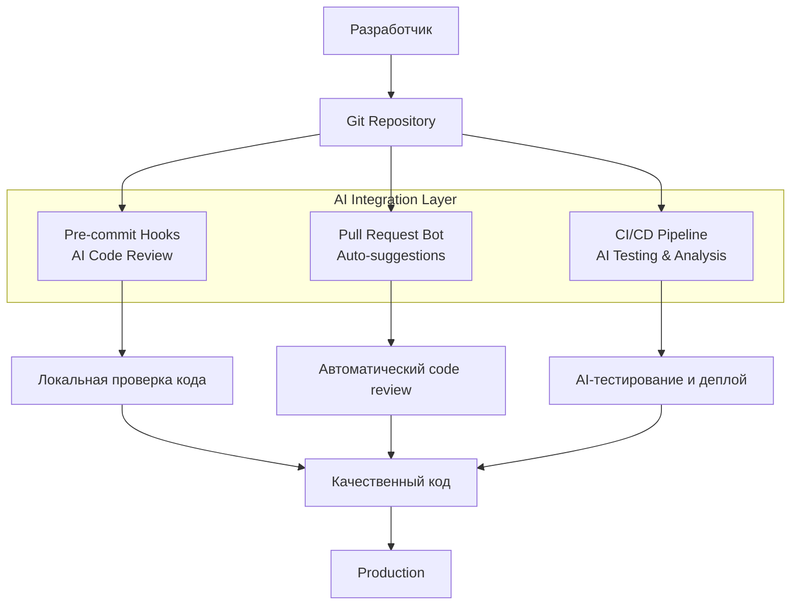
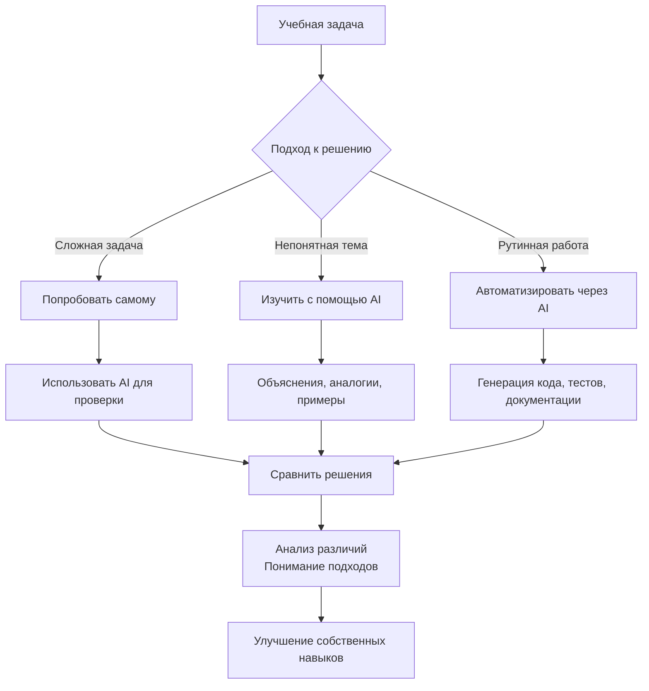
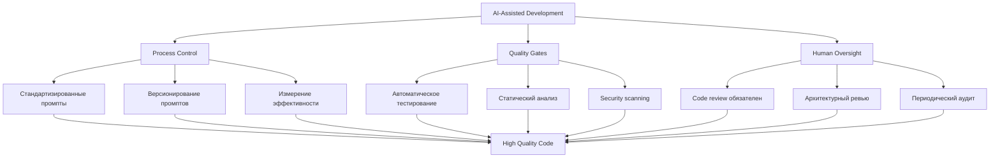

# РАЗДЕЛ 6: ВАЙБ-КОДИНГ И СОРЦ. ОТ

> [!abstract] AI-ассистированная разработка
> Интеграция искусственного интеллекта в процесс программирования для повышения эффективности и качества кода.

---

## 39. Назовите инструменты для вайб-кодинга.



**Основные категории инструментов:**

1. **Автодополнение кода** — предсказание следующей строки
2. **Генерация из описания** — код по текстовому описанию
3. **Анализ и рефакторинг** — улучшение существующего кода
4. **Отладка и объяснение** — помощь в понимании и исправлении кода
5. **Документирование** — автоматическая генерация документации

---

### a. Объясните разницу между GitHub Copilot и OpenAI Codex.

| Аспект | **GitHub Copilot** | **OpenAI Codex** |
|--------|-------------------|------------------|
| **Продукт** | Коммерческий продукт (расширение VS Code) | Модель/API (технология под капотом) |
| **Целевая аудитория** | Разработчики (интеграция в IDE) | Разработчики AI-приложений, компании |
| **Цена** | Платная подписка | Pay-per-use API |
| **Интеграция** | Глубокая интеграция в VS Code, JetBrains | REST API для кастомных интеграций |
| **Контекст** | Работает с текущим файлом и проектом | Работает с предоставленным промптом |
| **Настройка** | Ограниченная настройка | Полный контроль через промпт-инжиниринг |
| **Пример использования** | Автодополнение при наборе кода | Генерация кода из текстового описания |

**Простая аналогия:**
- **OpenAI Codex** — это *двигатель* автомобиля
- **GitHub Copilot** — это *готовый автомобиль* с этим двигателем

---

### b. На какой модели основан GitHub Copilot?

**GitHub Copilot** первоначально был основан на **OpenAI Codex**, который является потомком GPT-3, специально дообученным на публичном коде с GitHub.

**Эволюция модели:**


**Технические детали:**
- **Исходная модель**: OpenAI Codex (12 B параметров)
- **Дообучение**: На 159 GB кода с GitHub (54 млн репозиториев)
- **Языки**: Поддержка всех популярных языков программирования
- **Контекст**: Работает в контексте открытого файла и проекта
- **Обновления**: Регулярно обновляется с улучшенными версиями моделей

---

## 40. Почему важно иметь code review даже при использовании AI генерированного кода?

**Code review для AI-кода критически важен потому что:**



**Ключевые причины для code review AI-кода:**
1. **Безопасность** — AI может генерировать уязвимый код
2. **Качество** — проверка на соответствие стандартам команды
3. **Обучение** — понимание что и как сгенерировал AI
4. **Ответственность** — конечная ответственность лежит на разработчике
5. **Контекст** — AI не знает всей бизнес-логики проекта

---

### a. Назовите три главных риска использования Copilot в production коде.

**Топ-3 риска:**

1. **Безопасность (Security Vulnerabilities)**
   ```python
   # ❌ Пример опасного кода, который может сгенерировать Copilot
   query = f"SELECT * FROM users WHERE id = {user_input}"  # SQL инъекция!
   ```

2. **Лицензионные проблемы (License Compliance)**
   - Копирование кода с неподходящей лицензией
   - Нарушение GPL, AGPL и других copyleft лицензий
   - Потенциальные судебные иски

3. **Галлюцинации и ложная уверенность**
   - Несуществующие функции/библиотеки
   - Устаревшие API и методы
   - Код, который компилируется, но работает неправильно

**Дополнительные риски:**
- **Производительность** — неоптимальные алгоритмы
- **Поддержка** — сложно поддерживать непонятный код
- **Зависимости** — добавление ненужных библиотек

---

### b. Как проверить качество кода от LLM?

**Многоуровневая система проверки:**

```python
class LLMCodeQualityChecker:
    def __init__(self):
        self.checkers = [
            SyntaxChecker(),
            SecurityChecker(),
            PerformanceChecker(),
            StyleChecker(),
            LicenseChecker(),
            TestCoverageChecker()
        ]
    
    def check_code(self, generated_code, context=None):
        results = {
            'score': 0,
            'issues': [],
            'recommendations': []
        }
        
        for checker in self.checkers:
            checker_results = checker.analyze(generated_code, context)
            results['issues'].extend(checker_results.get('issues', []))
            results['recommendations'].extend(checker_results.get('recommendations', []))
        
        # Рассчитываем итоговый score
        results['score'] = self.calculate_score(results['issues'])
        
        return results
```

**Конкретные методы проверки:**

1. **Статический анализ** — ESLint, Pylint, SonarQube
2. **Тестирование** — юнит-тесты, интеграционные тесты
3. **Ручная проверка** — code review коллегами
4. **Безопасность** — SAST tools (Snyk, Checkmarx)
5. **Производительность** — профилирование, бенчмарки
6. **Читаемость** — метрики сложности кода

**Чек-лист для проверки AI-кода:**
- [ ] Код компилируется/интерпретируется без ошибок
- [ ] Проходят базовые юнит-тесты
- [ ] Нет очевидных уязвимостей безопасности
- [ ] Соответствует code style проекта
- [ ] Нет плагиатного копирования
- [ ] Документация корректна и понятна
- [ ] Производительность адекватна для задачи

---

## 41. Как написать комментарий, чтобы LLM сгенерировали правильный код?

**Структура эффективного промпта для генерации кода:**

```
КОНТЕКСТ + ТРЕБОВАНИЯ + ПРИМЕРЫ + ОГРАНИЧЕНИЯ + ФОРМАТ
```

**Пример плохого vs хорошего промпта:**

```python
# ❌ ПЛОХО: Слишком общий
"Напиши функцию для работы с пользователями"

# ✅ ХОРОШО: Конкретный и детальный
"""
Напиши функцию на Python для аутентификации пользователя.

КОНТЕКСТ:
- Работаем с FastAPI приложением
- Используем JWT для токенов
- Данные пользователей в PostgreSQL

ТРЕБОВАНИЯ:
1. Принимает email и password
2. Проверяет хеш пароля с bcrypt
3. Генерирует JWT токен на 24 часа
4. Возвращает токен и данные пользователя
5. Логирует успешные и неуспешные попытки

ОГРАНИЧЕНИЯ:
- Используй typing annotations
- Добавь docstring в Google стиле
- Обработай исключения (Invalid credentials, DB errors)
- Не используй сырые SQL, только SQLAlchemy ORM

ФОРМАТ ВЫВОДА:
Только код функции, без объяснений.
"""
```

---

### a. Как грамотно попросить LLM написать функцию?

**Шаблон для запроса функции:**

```python
# ШАБЛОН ПРОМПТА
"""
НАЗНАЧЕНИЕ: [Что должна делать функция?]
ЯЗЫК: [Python/JavaScript/Java/etc]
БИБЛИОТЕКИ: [Какие библиотеки использовать?]
ВХОДНЫЕ ПАРАМЕТРЫ: [Что принимает функция?]
ВЫХОДНЫЕ ДАННЫЕ: [Что возвращает?]
ОБРАБОТКА ОШИБОК: [Какие исключения обрабатывать?]
ПРИМЕР ИСПОЛЬЗОВАНИЯ: [Пример вызова функции]
ДОПОЛНИТЕЛЬНЫЕ ТРЕБОВАНИЯ: [Производительность, безопасность и т.д.]
"""
```

**Конкретный пример:**

```python
"""
НАЗНАЧЕНИЕ: Фильтрация списка объектов по нескольким критериям
ЯЗЫК: Python 3.10+
БИБЛИОТЕКИ: Только стандартная библиотека

ВХОДНЫЕ ПАРАМЕТРЫ:
- items: List[Dict] - список объектов для фильтрации
- filters: Dict[str, Any] - словарь критериев фильтрации
- логические операторы: AND для всех критериев

ВЫХОДНЫЕ ДАННЫЕ:
- Отфильтрованный список объектов
- Пустой список если ничего не найдено

ОБРАБОТКА ОШИБОК:
- ValueError если filters пустой
- TypeError если items не список

ПРИМЕР ИСПОЛЬЗОВАНИЯ:
items = [{'name': 'Alice', 'age': 30}, {'name': 'Bob', 'age': 25}]
filters = {'age': 30}
result = filter_items(items, filters)  # [{'name': 'Alice', 'age': 30}]

ДОПОЛНИТЕЛЬНЫЕ ТРЕБОВАНИЯ:
- Использовать typing annotations
- Добавить docstring
- Написать эффективный алгоритм (O(n))
- Поддержка вложенных полей через dot notation
"""
```

---

### b. Как правильно задать запрос LLM для написания функции сортировки?

**Пример запроса для функции сортировки:**

```python
"""
Напиши функцию сортировки списка объектов на Python.

ТРЕБОВАНИЯ К ФУНКЦИИ:
1. Название: sort_objects
2. Параметры:
   - objects: List[Dict] - список словарей для сортировки
   - key: str - поле для сортировки
   - reverse: bool = False - порядок сортировки
3. Возвращает: отсортированный список

ОСОБЕННОСТИ:
- Поддерживает сортировку по вложенным полям (через dot notation)
- Обрабатывает разные типы данных (str, int, float, datetime)
- При равных значениях сохраняет исходный порядок (stable sort)
- Работает с отсутствующими полями (помещает в конец)

ПРИМЕР ИСПОЛЬЗОВАНИЯ:
data = [
    {'name': 'Alice', 'age': 30, 'score': 85.5},
    {'name': 'Bob', 'age': 25, 'score': 92.0},
    {'name': 'Charlie', 'score': 78.0}
]

# Сортировка по возрасту
sorted_by_age = sort_objects(data, 'age')
# Сортировка по вложенному полю
nested_data = [{'user': {'profile': {'age': 30}}}]
sorted_nested = sort_objects(nested_data, 'user.profile.age')

КОНСТРАЙНТЫ:
- Не использовать sorted() с key=lambda (реализовать алгоритм)
- Использовать алгоритм Timsort или аналог
- Добавить обработку ошибок для некорректных ключей
- Время выполнения O(n log n)
- Документировать сложные случаи в docstring

ФОРМАТ: Верни только код функции с typing annotations.
"""
```

---

## 42. Как обработать ошибку, если LLM сгенерировала неправильный код?

**Стратегия обработки ошибок AI-кода:**



**Конкретные шаги для исправления:**

1. **Изолируйте проблему** — определите точное место ошибки
2. **Соберите контекст** — что должно было работать vs что работает
3. **Сформулируйте исправление** — конкретное описание что не так
4. **Используйте итеративный подход** — небольшие исправления
5. **Протестируйте каждое изменение** — убедитесь что исправление работает

**Пример диалога для исправления:**

```python
# Первый промпт (неправильный результат)
"""
Напиши функцию для расчета факториала.
"""

# Неправильный результат (не обрабатывает 0 и отрицательные числа)
def factorial(n):
    result = 1
    for i in range(1, n+1):
        result *= i
    return result

# Второй промпт (исправление)
"""
Исправь функцию factorial:
1. Добавь проверку: если n < 0, вызывай ValueError
2. Обработай случай n = 0 (факториал 0 = 1)
3. Добавь typing annotation для параметра и возвращаемого значения
4. Добавь docstring с примером использования
"""
```

---

### a. Как LLM может помочь в отладке (debugging) вашего кода?

**Способы использования LLM для отладки:**

1. **Объяснение ошибок**
   ```python
   # Промпт: "Объясни эту ошибку Python и как ее исправить:
   # TypeError: can only concatenate str (not "int") to str"
   
   # Ответ LLM:
   """
   Ошибка возникает при попытке сложить строку с числом.
   
   ПРИЧИНА: Python не позволяет автоматически конвертировать типы.
   
   РЕШЕНИЕ 1: Преобразовать число в строку
   result = "Number: " + str(42)
   
   РЕШЕНИЕ 2: Использовать f-строку
   result = f"Number: {42}"
   
   РЕШЕНИЕ 3: Использовать format()
   result = "Number: {}".format(42)
   """
   ```

2. **Поиск причин багов**
   ```python
   # Промпт: "В этом коде есть утечка памяти. Помоги найти причину."
   
   class DataProcessor:
       def __init__(self):
           self.cache = {}
       
       def process(self, data):
           # Логика обработки...
           self.cache[id(data)] = processed_data  # ⚠️ Утечка!
           return processed_data
   
   # Ответ LLM:
   """
   ПРОБЛЕМА: Кэш хранит ссылки на объекты бесконечно.
   
   РЕШЕНИЯ:
   1. Использовать WeakValueDictionary
   2. Добавить лимит размера кэша
   3. Реализовать TTL для записей
   """
   ```

4. **Анализ сложных ошибок**
   ```python
   # Промпт: "Почему этот код работает медленно? Предложи оптимизацию."
   
   def find_duplicates(items):
       duplicates = []
       for i in range(len(items)):
           for j in range(i+1, len(items)):
               if items[i] == items[j]:
                   duplicates.append(items[i])
       return duplicates
   
   # Ответ LLM:
   """
   АНАЛИЗ ПРОБЛЕМ:
   - Сложность O(n²) - неэффективно для больших списков
   - Дублирование дубликатов в результате
   
   ОПТИМИЗАЦИЯ:
   Использовать set для O(n) решения:
   
   def find_duplicates(items):
       seen = set()
       duplicates = set()
       for item in items:
           if item in seen:
               duplicates.add(item)
           else:
               seen.add(item)
       return list(duplicates)
   """
   ```

**Инструменты AI для отладки:**
- **GitHub Copilot Chat** — встроенная помощь в VS Code
- **Cursor IDE** — интегрированный AI для отладки
- **ChatGPT Code Interpreter** — выполнение и отладка кода
- **Bugsnag AI Assistant** — анализ ошибок в production

---

## 43. Как организовать workflow для работы человека + AI генератор кода?

**Оптимальный workflow для AI-ассистированной разработки:**



**Роли в AI-ассистированном workflow:**

| Действие | AI ответственность | Человек ответственность |
|----------|-------------------|-------------------------|
| **Идея** | Генерация вариантов | Выбор направления |
| **Прототип** | Написание кода | Формулировка требований |
| **Тестирование** | Генерация тестов | Проверка покрытия |
| **Рефакторинг** | Предложения улучшений | Принятие решений |
| **Документация** | Генерация docs | Проверка точности |
| **Review** | Статический анализ | Критическая оценка |

---

### a. Что значит "итеративный prompt engineering" и почему это важно?

**Итеративный prompt engineering** — это процесс постепенного улучшения промптов через циклы обратной связи, где каждый следующий промпт строится на основе результатов предыдущего.

**Почему это важно:**
1. **LLM не понимают с первого раза** — нужны уточнения
2. **Сложные задачи требуют разбиения** — шаг за шагом
3. **Контекст накапливается** — каждый итерация добавляет информацию
4. **Ошибки исправляются постепенно** — вместо переписывания с нуля

**Пример итеративного подхода:**

```python
# ИТЕРАЦИЯ 1: Базовый запрос
prompt1 = "Напиши функцию для парсинга CSV"

# Результат: Базовая функция, но без обработки ошибок

# ИТЕРАЦИЯ 2: Добавляем требования
prompt2 = """
Добавь к предыдущей функции:
1. Обработку разных разделителей (запятая, точка с запятой, таб)
2. Пропуск строк с ошибками вместо падения
3. Конвертацию типов данных (int, float, date)
"""

# ИТЕРАЦИЯ 3: Уточняем детали
prompt3 = """
Дополнительно:
- Добавь поддержку quoted fields с кавычками
- Реализуй streaming для больших файлов
- Добавь лимит на чтение строк
"""

# ИТЕРАЦИЯ 4: Тестирование
prompt4 = """
Напиши unit tests для этой функции, покрывающие:
- Корректный парсинг нормального CSV
- Обработку файлов с разными разделителями
- Обработку ошибок (битые строки, несоответствие колонок)
"""
```

**Преимущества итеративного подхода:**
- ✅ **Контроль качества** — постепенное улучшение
- ✅ **Обучение системы** — LLM лучше понимает контекст
- ✅ **Экономия времени** — меньше переделок
- ✅ **Предсказуемость** — результаты становятся стабильнее

---

## 44. Какие языки программирования сложнее для LLM генерации кода?

**Сложность языков для LLM (от сложного к простому):**

| Уровень сложности | Языки | Причины сложности |
|-------------------|-------|-------------------|
| **Очень сложные** | COBOL, Fortran, Assembly | Устаревшие, мало тренировочных данных |
| **Сложные** | Haskell, Prolog, Lisp | Функциональные, уникальные парадигмы |
| **Средние** | C++, Rust, Go | Системные, strict typing, manual memory |
| **Относительно простые** | Java, C#, Swift | ООП, много тренировочных данных |
| **Простые** | Python, JavaScript, TypeScript | Популярные, много примеров, динамические |

**Факторы влияющие на сложность:**

1. **Объем тренировочных данных** — больше данных = лучше качество
2. **Популярность языка** — популярные языки лучше поддерживаются
3. **Парадигма программирования** — ООП проще чем функциональное
4. **Строгость типизации** — динамические языки проще для генерации
5. **Сложность синтаксиса** — простой синтаксис = лучше результаты

**Пример сравнения качества генерации:**

```python
# Python (хорошая генерация)
# Промпт: "Напиши функцию для расчета чисел Фибоначчи"
def fibonacci(n):
    if n <= 0:
        return []
    elif n == 1:
        return [0]
    elif n == 2:
        return [0, 1]
    
    fib = [0, 1]
    for i in range(2, n):
        fib.append(fib[i-1] + fib[i-2])
    return fib

# Haskell (более сложная генерация)
-- Промпт: "Напиши функцию для расчета чисел Фибоначчи на Haskell"
fibonacci :: Int -> [Int]
fibonacci n = take n fib
  where fib = 0 : 1 : zipWith (+) fib (tail fib)
```

---

### a. Могут ли LLM рефакторить код для 1 C?

**Да, но с ограничениями.** LLM могут работать с кодом 1 C, но качество будет ниже чем для популярных языков.

**Возможности LLM для 1 C:**

1. **✅ Базовый рефакторинг** — переименование переменных, форматирование
2. **✅ Простые преобразования** — изменение структуры функций
3. **⚠️ Сложный рефакторинг** — изменение архитектуры, оптимизация запросов
4. **❌ Специфичные паттерны 1 C** — особенности платформы, метаданные

**Ограничения для 1 C:**
- **Мало тренировочных данных** — код 1 C обычно закрытый
- **Специфичный синтаксис** — уникальные конструкции языка
- **Интеграция с платформой** — требуется знание API 1 C
- **Бизнес-логика** — сложно понять контекст без доменных знаний

**Пример промпта для рефакторинга 1 C:**
```
Рефакторинг кода 1C:

ИСХОДНЫЙ КОД:
Функция РассчитатьСумму(Товары)
    Сумма = 0;
    Для каждого Товар из Товары Цикл
        Сумма = Сумма + Товар.Цена * Товар.Количество;
    КонецЦикла;
    Возврат Сумма;
КонецФункции

ЗАДАЧА:
1. Добавить проверку на пустой массив Товары
2. Добавить обработку ошибок (нечисловые значения)
3. Использовать цикл Для i = 0 По Товары.Количество() - 1
4. Добавить комментарии на русском языке
```

**Рекомендации для работы с 1 C:**
1. Начинать с простых задач
2. Предоставлять больше контекста
3. Использовать итеративный подход
4. Всегда проверять результат в реальной среде 1 C

---

## 45. Как объединить Git, CI/CD и AI tools?

**Интеграционная архитектура:**



**Конкретные интеграции:**

1. **Pre-commit хуки с AI:**
```yaml
# .pre-commit-config.yaml
repos:
  - repo: https://github.com/coderabbitai/ai-pr-reviewer
    rev: v1.0.0
    hooks:
      - id: ai-code-review
        stages: [pre-commit]
        args: [--language=python, --strict]
```

2. **GitHub Actions с AI анализом:**
```yaml
# .github/workflows/ai-review.yml
name: AI Code Review
on: [pull_request]

jobs:
  review:
    runs-on: ubuntu-latest
    steps:
      - uses: actions/checkout@v3
      - name: AI Code Analysis
        uses: codacy/codacy-analysis-cli-action@v4
        with:
          project-token: ${{ secrets.CODACY_TOKEN }}
          ai-review: true
      - name: Security Scan
        uses: snyk/actions/python@master
        with:
          args: --ai-assisted-fixes
```

3. **AI-ассистент в Pull Requests:**
```yaml
# .github/copilot.yml
review:
  enabled: true
  suggestions: true
  auto_approve_min_confidence: 0.9
  
test_generation:
  enabled: true
  coverage_target: 80%
  
security:
  scan: true
  auto_fix: true
```

---

### a. Как использовать LLM в CI/CD?

**Сценарии использования LLM в CI/CD:**

1. **Генерация тестов автоматически**
```yaml
# .github/workflows/ai-tests.yml
- name: Generate Tests
  run: |
    # AI анализирует код и генерирует недостающие тесты
    python -m ai_test_generator \
      --source-dir ./src \
      --test-dir ./tests \
      --coverage-target 85%
```

2. **Анализ безопасности кода**
```yaml
- name: AI Security Scan
  uses: step-security/ai-scan@v1
  with:
    languages: 'python,javascript'
    severity-threshold: 'high'
    auto-fix: true  # AI предлагает исправления
```

3. **Автоматический рефакторинг**
```yaml
- name: Code Quality Improvement
  if: github.event_name == 'push' && github.ref == 'refs/heads/main'
  run: |
    # AI анализирует качество кода и создает PR с улучшениями
    python -m ai_refactor \
      --repo ${{ github.repository }} \
      --threshold 0.7 \
      --auto-create-pr
```

4. **Генерация документации**
```yaml
- name: Update Documentation
  run: |
    # AI генерирует/обновляет документацию на основе кода
    Python -m ai_docs \
      --input ./src \
      --output ./docs \
      --format mkdocs
```

5. **Performance optimization suggestions**
```yaml
- Name: Performance Analysis
  Run: |
    # AI анализирует производительность и предлагает оптимизации
    Python -m ai_perf_analyzer \
      --benchmark \
      --suggest-optimizations \
      --create-issue-on-regression
```

**Интеграция с существующими инструментами:**
- **SonarQube + AI** — интеллектуальный анализ качества
- **Jenkins AI plugins** — AI-ассистенты в пайплайнах
- **GitLab Duo** — встроенный AI в GitLab CI/CD
- **Azure DevOps AI** — Microsoft's AI интеграции

---

## 46. Как студенту использовать AI при обучении?

**Ответственный подход студента к AI:**



**Этические принципы для студентов:**

1. **AI как помощник, не замена** — использовать для обучения, а не для обмана
2. **Понимать, а не копировать** — разбираться в сгенерированном коде
3. **Честность в академической работе** — не выдавать AI работу за свою
4. **Развитие собственных навыков** — AI должен дополнять, а не заменять обучение

---

### a. Почему нужно понимать базовые концепции?

**Причины понимания основ:**

| Без понимания основ | С пониманием основ |
|---------------------|-------------------|
| ❌ **Зависимость от AI** — не сможете работать без него | ✅ **Контроль над AI** — используете его эффективно |
| ❌ **Не видите ошибок AI** — принимаете галлюцинации за правду | ✅ **Критическое мышление** — проверяете и корректируете AI |
| ❌ **Не можете объяснить код** — проблемы на собеседованиях | ✅ **Глубокое понимание** — можете объяснить любую часть |
| ❌ **Трудности с отладкой** — не понимаете почему код не работает | ✅ **Самостоятельность** — можете исправить ошибки без AI |

**Пример:**
```python
# Студент БЕЗ понимания:
Prompt = "Напиши быструю функцию сортировки"
# Копирует результат не понимая алгоритма

# Студент С пониманием:
Prompt = """
Напиши реализацию quicksort с объяснением:
1. Как работает pivot selection
2. Рекурсивное разделение
3. Базовый случай
4. Сложность O (n log n) в среднем случае
"""
# Изучает алгоритм через AI
```

---

### b. Какие задачи LLM делает лучше, а какие требуют человеческого внимания?

**Распределение задач AI vs Человек:**

| Задача | AI лучше | Человек лучше |
|--------|----------|---------------|
| **Генерация шаблонного кода** | ✅ | ❌ |
| **Поиск синтаксических ошибок** | ✅ | ❌ |
| **Написание документации** | ✅ | ⚠️ |
| **Оптимизация производительности** | ⚠️ | ✅ |
| **Архитектурные решения** | ❌ | ✅ |
| **Понимание бизнес-контекста** | ❌ | ✅ |
| **Креативное решение проблем** | ❌ | ✅ |
| **Работа с легаси кодом** | ⚠️ | ✅ |
| **Коммуникация с заказчиком** | ❌ | ✅ |
| **Этические решения** | ❌ | ✅ |

**Конкретные примеры:**

**AI лучше:**
```python
# Генерация boilerplate кода
Class UserSerializer (serializers. ModelSerializer):
    # AI может быстро сгенерировать все поля
    Class Meta:
        Model = User
        Fields = '__all__'
```

**Человек лучше:**
```python
# Архитектурное решение
# Только человек понимает бизнес-логику и ограничения
Def choose_architecture (requirements):
    """
    Выбор между монолитом и микросервисами
    Зависит от:
    - Команды разработки
    - Бюджета
    - Времени на рынок
    - Масштабируемость
    """
```

---

## 47. Как обеспечить качество AI-assisted разработки?

**Фреймворк качества для AI-разработки:**



---

### a. Какие главные вызовы AI в программировании?

**Топ-5 вызовов AI в разработке:**

1. **Безопасность (Security)**
   - AI может генерировать уязвимый код
   - Сложность проверки безопасности AI-кода
   - Риски data leakage через промпты

2. **Интеллектуальная собственность (IP)**
   - Копирование кода с лицензионными ограничениями
   - Права на сгенерированный код
   - Конфиденциальность корпоративного кода

3. **Качество кода (Code Quality)**
   - Галлюцинации и ложная уверенность
   - Неоптимальные алгоритмы
   - Плохая архитектура

4. **Зависимость и навыки (Dependency & Skills)**
   - Деградация навыков разработчиков
   - Зависимость от конкретных AI инструментов
   - Vendor lock-in

5. **Этика и ответственность (Ethics & Accountability)**
   - Кто отвечает за ошибки в AI-коде?
   - Смещение карьеры разработчиков
   - Доступность AI инструментов

**Решение вызовов:**
- **Гибридный подход** — AI + человеческий контроль
- **Обучение команды** — правильное использование AI
- **Процессы и стандарты** — четкие guidelines
- **Непрерывный мониторинг** — метрики качества

---

### b. Какие инструменты для автоматизации с AI?

**Инструменты AI-автоматизации в разработке:**

| Категория | Инструменты | Что автоматизируют |
|-----------|-------------|-------------------|
| **Кодогенерация** | GitHub Copilot, Tabnine, Codeium | Написание кода, автодополнение |
| **Тестирование** | CodiumAI, Testim, Mabl | Генерация тестов, тест-кейсов |
| **Документация** | Mintlify, Scribe, Swimm | Автогенерация docs, комментарии |
| **Code Review** | Codacy, SonarQube AI, DeepSource | Автоматический анализ кода |
| **Рефакторинг** | Sourcery, CodeRabbit, Jit | Улучшение качества кода |
| **Отладка** | Rookout, Lightrun, Rook | AI-assisted debugging |
| **Деплой** | Harness, Spinnaker + AI | Интеллектуальный деплоймент |
| **Мониторинг** | Datadog AI, New Relic AIOps | AI-анализ метрик и логов |

**Пример настройки AI-автоматизации:**
```yaml
# Ai-automation-config. Yml
Automation:
  Code_generation:
    Enabled: true
    Tools: ["copilot", "tabnine"]
    Rules:
      Min_confidence: 0.8
      Require_human_review: true
  
  Testing:
    Enabled: true
    Tools: ["codium", "testim"]
    Coverage_target: 80%
    Auto_generate: true
  
  Documentation:
    Enabled: true
    Tools: ["mintlify"]
    Auto_update: true
  
  Deployment:
    Enabled: true
    Tools: ["harness"]
    Canary_analysis: true
    Rollback_on_failure: true
  
Quality_gates:
  Security_scan: required
  Performance_test: required
  Human_review: required_for_critical
```

**Метрики успешности AI-автоматизации:**
- **Скорость разработки** — время от идеи до production
- **Качество кода** — количество багов в production
- **Покрытие тестами** — процент покрытия AI-тестами
- **Удовлетворенность команды** — developer experience
- **Бизнес-метрики** — время на рынок, ROI

---

> [!summary] Итоговые выводы
> 1. **AI-инструменты** — мощные помощники, но не замена разработчикам
> 2. **Code review обязателен** — даже для AI-сгенерированного кода
> 3. **Промпт-инжиниринг** — ключевой навык для эффективной работы с AI
> 4. **Итеративный подход** — постепенное улучшение через обратную связь
> 5. **Баланс AI и человека** — AI для рутины, человек для сложных решений
> 6. **Интеграция в процессы** — Git, CI/CD, code review с AI
> 7. **Обучение и этика** — ответственное использование AI в обучении
> 8. **Качество и безопасность** — приоритеты при использовании AI в production

