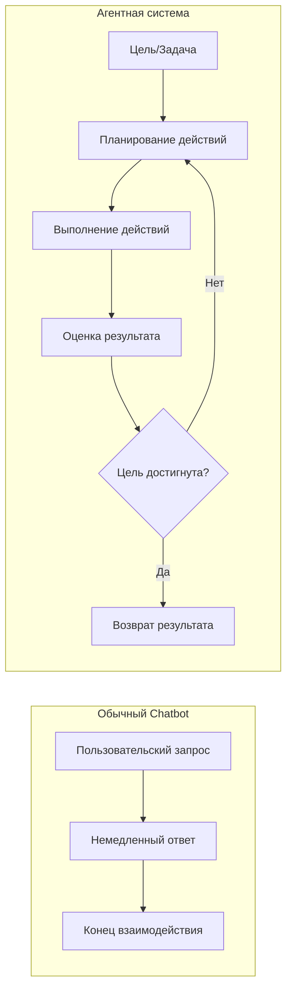
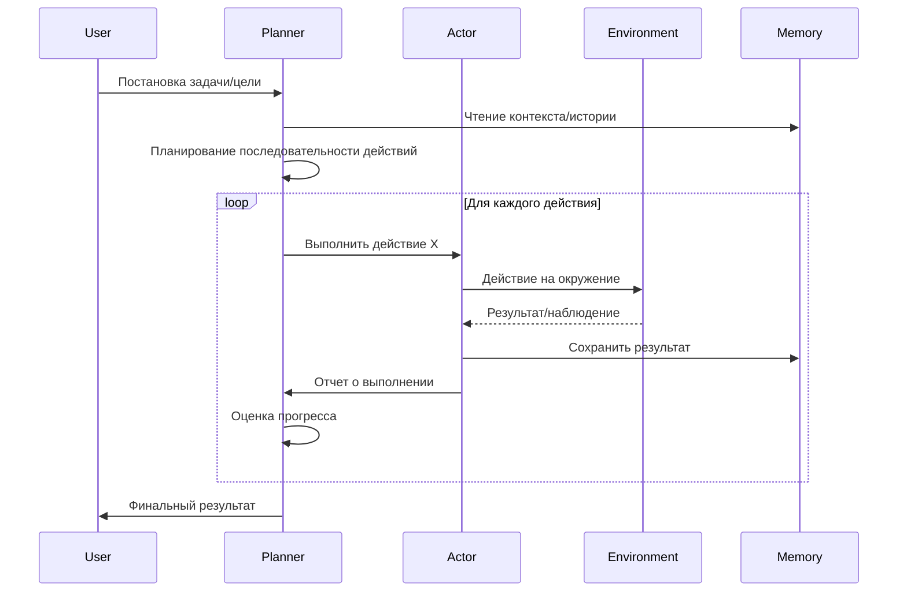
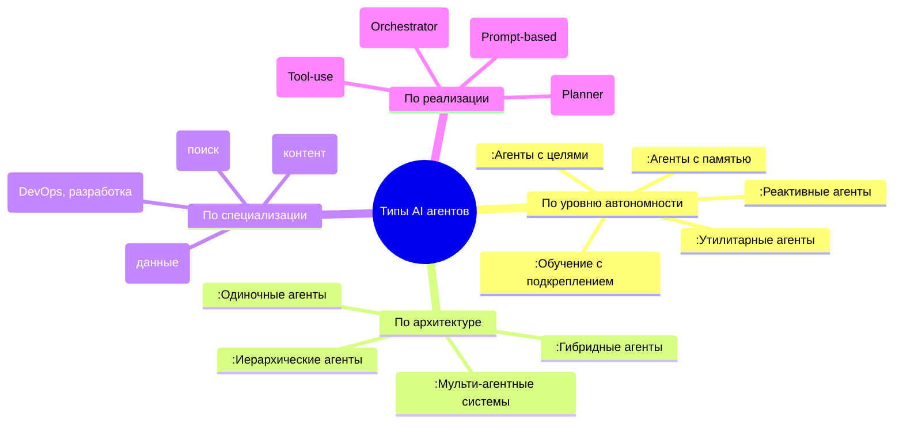
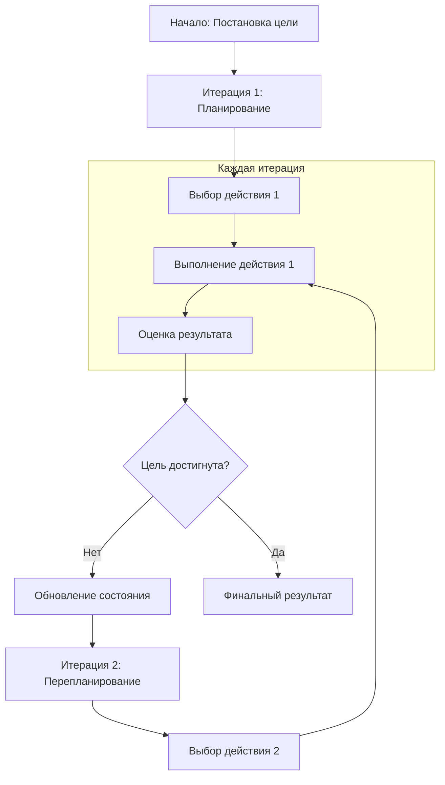
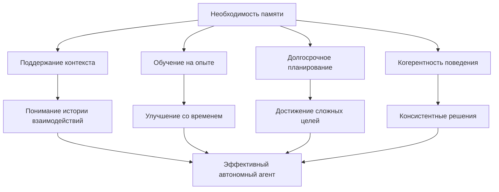
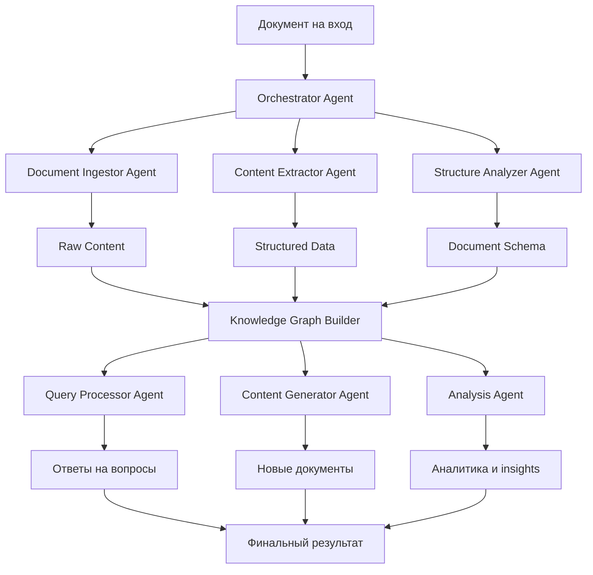
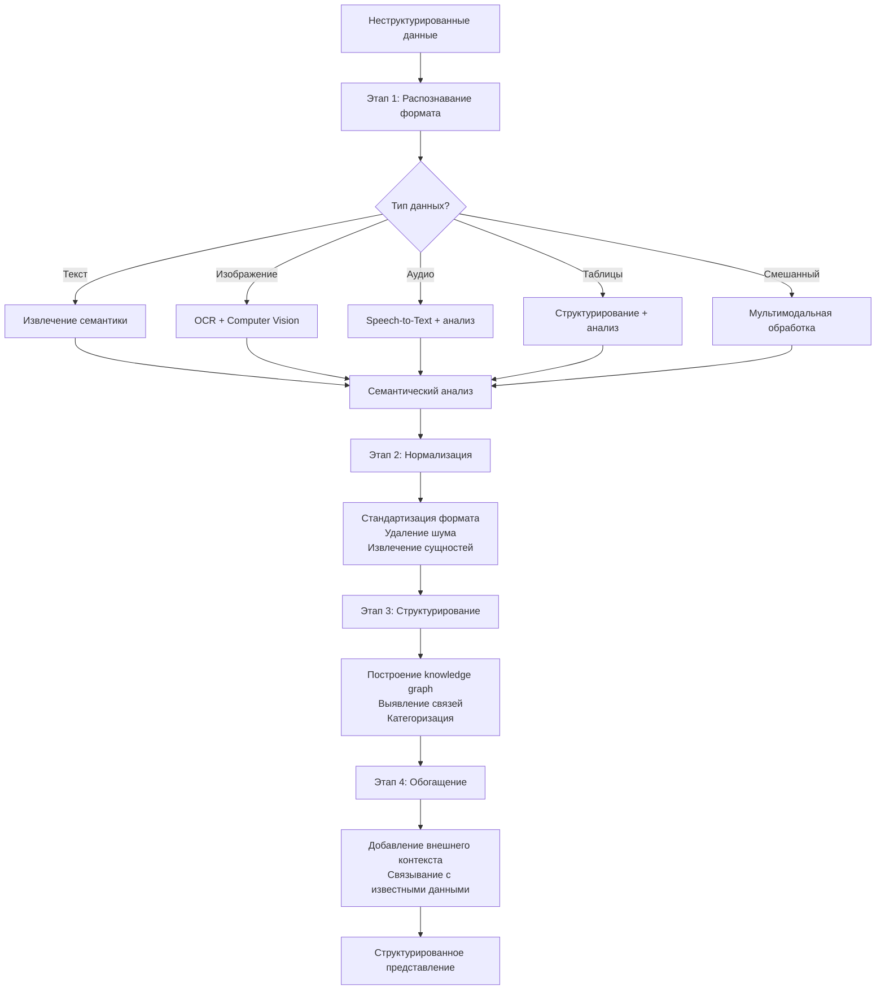
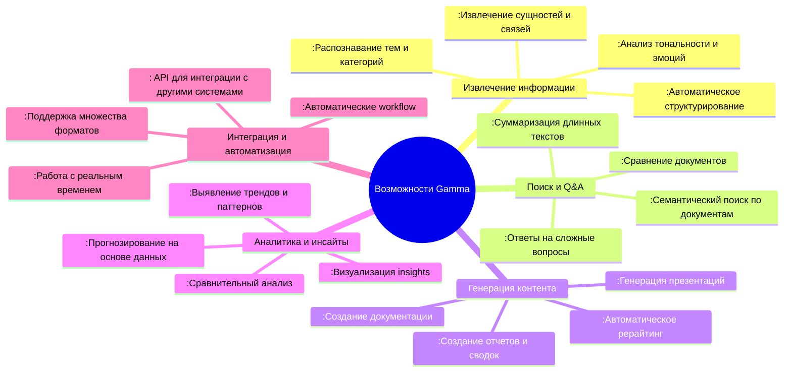
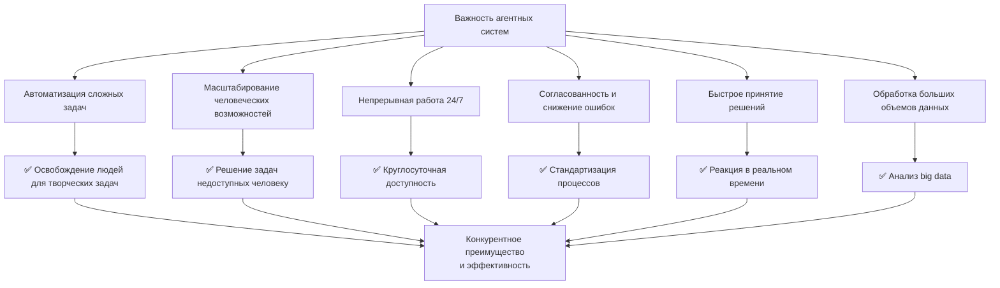
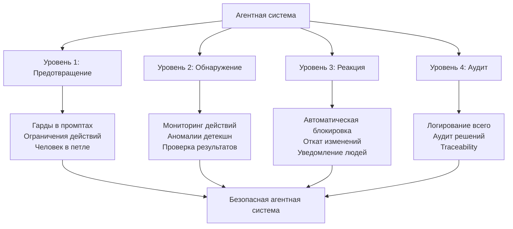

> [!abstract] Интеллектуальные автономные системы
> Автономные AI-агенты, способные выполнять сложные задачи через планирование, выполнение и итеративное улучшение.

---

## 48. Что такое агентная система в контексте AI и чем она отличается от обычного chatbot?

**Агентная система (AI Agent)** — это автономная программная система, которая воспринимает окружение, принимает решения и выполняет действия для достижения поставленных целей, используя AI модели для рассуждений и планирования.

**Ключевые отличия от обычного chatbot:**



**Сравнительная таблица:**

| Характеристика | **Обычный Chatbot** | **Агентная система** |
|----------------|---------------------|----------------------|
| **Цель** | Ответить на вопрос | Достичь цели/решить задачу |
| **Подход** | Реактивный (реагирует) | Проактивный (планирует) |
| **Контекст** | Текущий диалог | Долгосрочная цель и состояние |
| **Действия** | Только генерация текста | Множество действий (API, код, поиск) |
| **Автономность** | Низкая | Высокая (самостоятельное принятие решений) |
| **Сложность** | Простые Q&A | Сложные многошаговые задачи |
| **Пример** | ChatGPT интерфейс | AutoGPT, BabyAGI |

> [!note] Ключевая концепция
> **Chatbot отвечает на вопросы, агентная система решает проблемы.**

---

### a. Какой цикл работы AI Agent?

**Цикл работы AI Agent (Reasoning-Acting Loop):**



**Детализированный цикл работы:**

1. **Восприятие (Perception)**
   - Агент получает информацию из окружения
   - Читает текущее состояние и историю

2. **Рассуждение (Reasoning)**
   - Анализирует информацию
   - Планирует последовательность действий
   - Оценивает возможные последствия

3. **Действие (Action)**
   - Выполняет запланированные действия
   - Взаимодействует с API, инструментами, системами
   - Модифицирует окружение

4. **Обратная связь (Feedback)**
   - Оценивает результат действия
   - Обновляет состояние и память
   - Корректирует план при необходимости

**Пример кода цикла агента:**
```python
class AIAgent:
    def __init__(self, llm, tools, memory):
        self.llm = llm  # Языковая модель
        self.tools = tools  # Доступные инструменты
        self.memory = memory  # Память агента
        
    def run(self, goal):
        """Основной цикл работы агента"""
        plan = self.plan(goal)
        
        while not self.is_goal_achieved(goal):
            # 1. Восприятие
            state = self.perceive()
            
            # 2. Рассуждение
            next_action = self.reason(state, plan)
            
            # 3. Действие
            result = self.act(next_action)
            
            # 4. Обратная связь
            self.update_memory(state, action, result)
            
            # Коррекция плана если нужно
            if not self.is_progress_good():
                plan = self.replan(goal)
        
        return self.get_final_result()
```

---

### b. Какие типы агентов существуют?

**Классификация AI агентов по сложности и возможностям:**




**Основные типы агентов:**

1. **Простые реактивные агенты (Simple Reflex Agents)**
   ```python
   # Пример: if-else правила
   if "погода" in query:
       return get_weather()
   elif "время" in query:
       return get_time()
   ```

2. **Агенты с памятью (Model-based Reflex Agents)**
   ```python
   class AgentWithMemory:
       def __init__(self):
           self.memory = {}
           
       def act(self, observation):
           # Использует историю взаимодействий
           context = self.memory.get_last_interactions()
           return self.llm.generate(context + observation)
   ```

3. **Агенты с целями (Goal-based Agents)**
   ```python
   class GoalBasedAgent:
       def __init__(self, goal):
           self.goal = goal  # "Разработать веб-приложение"
           self.plan = self.create_plan(goal)
           
       def create_plan(self, goal):
           # Разбивает цель на подзадачи
           return ["Спроектировать архитектуру", 
                   "Написать код", 
                   "Протестировать"]
   ```

4. **Утилитарные агенты (Utility-based Agents)**
   ```python
   class UtilityAgent:
       def choose_action(self, possible_actions):
           # Выбирает действие с максимальной utility
           utilities = []
           for action in possible_actions:
               utility = self.calculate_utility(action)
               utilities.append((action, utility))
           
           return max(utilities, key=lambda x: x[1])[0]
   ```

5. **Мульти-агентные системы (Multi-Agent Systems)**
   ```python
   class MultiAgentSystem:
       def __init__(self):
           self.agents = {
               'planner': PlanningAgent(),
               'coder': CodingAgent(),
               'tester': TestingAgent(),
               'reviewer': ReviewAgent()
           }
           
       def complete_project(self, requirements):
           # Агенты коллаборируют для решения задачи
           plan = self.agents['planner'].create_plan(requirements)
           code = self.agents['coder'].implement(plan)
           tests = self.agents['tester'].test(code)
           return self.agents['reviewer'].review_all(plan, code, tests)
   ```

---

### c. Приведите пример агентной системы, которую вы можете встроить в свое приложение.

**Пример: Агентная система для автоматической обработки пользовательских обращений**

```python
class CustomerSupportAgentSystem:
    """Агентная система для автоматической обработки обращений поддержки"""
    
    def __init__(self):
        self.agents = {
            'classifier': TicketClassifierAgent(),
            'responder': ResponseGeneratorAgent(),
            'escalator': EscalationAgent(),
            'followup': FollowUpAgent(),
            'analyzer': AnalyticsAgent()
        }
        self.memory = TicketMemory()
        
    def handle_ticket(self, ticket):
        """Полный цикл обработки тикета"""
        
        # 1. Агент классификации определяет тип проблемы
        ticket_type = self.agents['classifier'].classify(ticket)
        self.memory.store_classification(ticket.id, ticket_type)
        
        # 2. В зависимости от типа - разные сценарии
        if ticket_type == 'simple_question':
            # Автоматический ответ
            response = self.agents['responder'].generate_response(ticket)
            self.send_response(ticket.user, response)
            
            # Запланировать follow-up
            self.agents['followup'].schedule_check(ticket.id, days=3)
            
        elif ticket_type == 'complex_issue':
            # Эскалация к человеку
            self.agents['escalator'].escalate_to_human(ticket)
            
        elif ticket_type == 'bug_report':
            # Создать issue в GitHub/Jira
            issue_id = self.create_issue_from_ticket(ticket)
            self.agents['responder'].send_acknowledgment(ticket.user, issue_id)
            
        # 3. Аналитика и улучшение
        self.agents['analyzer'].log_ticket_handling(ticket, ticket_type)
        
        return {
            'status': 'processed',
            'ticket_type': ticket_type,
            'actions_taken': self.memory.get_actions(ticket.id)
        }

# Пример использования в веб-приложении
@app.route('/api/support/ticket', methods=['POST'])
def create_ticket():
    ticket_data = request.json
    agent_system = CustomerSupportAgentSystem()
    
    # Агентная система обрабатывает тикет автономно
    result = agent_system.handle_ticket(ticket_data)
    
    # Человек только мониторит и вмешивается при эскалации
    if result['ticket_type'] == 'complex_issue':
        # Уведомление поддержке
        notify_human_support(ticket_data)
    
    return jsonify(result)
```

**Другие примеры встраиваемых агентных систем:**

1. **Агент для автоматического код-ревью**
   - Анализирует Pull Request
   - Предлагает улучшения
   - Генерирует тесты
   - Проверяет безопасность

2. **Агент для мониторинга инфраструктуры**
   - Следит за метриками
   - Автоматически масштабирует ресурсы
   - Предсказывает проблемы
   - Применяет фиксы

3. **Агент для персонализации контента**
   - Анализирует поведение пользователя
   - Генерирует персонализированные рекомендации
   - А/B тестирование
   - Оптимизация конверсии

---

## 49. Как агентная система работает итеративно (step-by-step)?

**Итеративный процесс работы агентной системы:**



**Детальный пошаговый процесс:**

**Шаг 1: Инициализация**
```python
# Агент получает цель
goal = "Разработать REST API для управления пользователями"
agent = APIDevelopmentAgent(goal=goal)
```

**Шаг 2: Первое планирование**
```python
# Агент создает начальный план
initial_plan = agent.plan()
"""
План:
1. Проектирование схемы БД
2. Создание моделей SQLAlchemy
3. Реализация CRUD endpoints
4. Добавление аутентификации
5. Написание документации
"""
```

**Шаг 3: Выполнение первого действия**
```python
# Агент выполняет первый шаг плана
action_result = agent.execute_action("design_database_schema")
# Результат: Схема users, roles, permissions
```

**Шаг 4: Оценка и корректировка**
```python
# Агент оценивает результат
is_success = agent.evaluate_result(action_result)

if not is_success:
    # Перепланирование с учетом новых данных
    updated_plan = agent.replan()
```

**Шаг 5: Следующая итерация**
```python
# Выбор следующего действия на основе текущего состояния
next_action = agent.choose_next_action()
# "create_sqlalchemy_models"
```

**Шаг 6: Продолжение до достижения цели**
```python
while not agent.is_goal_achieved():
    state = agent.get_current_state()
    action = agent.select_action(state)
    result = agent.execute(action)
    agent.update_knowledge(state, action, result)
    
    # Возможные корректировки
    if agent.needs_replanning():
        agent.replan()
```

**Пример реального итеративного процесса:**

```python
# Цель: "Найди информацию о лучших практиках REST API и создай документацию"

# Итерация 1: Поиск информации
action1 = "search_web query='REST API best practices 2024'"
result1 = agent.execute(action1)  # Находит 10 статей

# Итерация 2: Анализ найденного
action2 = "analyze_articles articles=result1 extract_key_points"
result2 = agent.execute(action2)  # Извлекает ключевые пункты

# Итерация 3: Структурирование информации
action3 = "organize_points points=result2 into_categories"
result3 = agent.execute(action3)  # Создает структуру документа

# Итерация 4: Генерация документации
action4 = "generate_documentation structure=result3 format=markdown"
result4 = agent.execute(action4)  # Генерирует README.md

# Итерация 5: Проверка качества
action5 = "review_documentation doc=result4 check_completeness"
result5 = agent.execute(action5)  # Находит недостающие разделы

# Итерация 6: Дополнение
if result5['missing_sections']:
    action6 = f"add_sections doc=result4 sections={result5['missing_sections']}"
    final_result = agent.execute(action6)
```

---

### a. Назовите две обязательные части агентной системы.

**Две обязательные части любой агентной системы:**

1. **Мозг/Планировщик (Brain/Planner)**
2. **Инструменты/Действия (Tools/Actions)**

**Детальное описание:**

**1. Мозг/Планировщик (Reasoning Engine)**
```python
class AgentBrain:
    """Ответственен за рассуждения, планирование и принятие решений"""
    
    def __init__(self, llm):
        self.llm = llm  # Языковая модель для рассуждений
        self.memory = {}  # Контекст и история
        
    def plan(self, goal):
        """Создает план достижения цели"""
        prompt = f"""
        Цель: {goal}
        История: {self.memory}
        Доступные инструменты: {self.tools}
        
        Создай пошаговый план:
        """
        return self.llm.generate(prompt)
        
    def decide_next_action(self, state):
        """Выбирает следующее действие на основе текущего состояния"""
        # Рассуждение о том, что делать дальше
        reasoning = self.llm.reason(state, self.memory)
        return self.select_action_from_reasoning(reasoning)
```

**2. Инструменты/Действия (Action Toolkit)**
```python
class AgentTools:
    """Набор инструментов для взаимодействия с окружением"""
    
    def __init__(self):
        self.tools = {
            'web_search': WebSearchTool(),
            'code_executor': CodeExecutor(),
            'api_client': APIClient(),
            'file_system': FileSystemTool(),
            'database': DatabaseTool()
        }
        
    def execute(self, action_name, **params):
        """Выполняет конкретное действие"""
        tool = self.tools.get(action_name)
        if not tool:
            raise ValueError(f"Инструмент {action_name} не найден")
        
        return tool.execute(**params)
        
    def get_available_actions(self, state):
        """Возвращает доступные действия в текущем состоянии"""
        available = []
        for name, tool in self.tools.items():
            if tool.can_execute(state):
                available.append(name)
        return available
```

**Минимальная рабочая агентная система:**
```python
class MinimalAgent:
    def __init__(self):
        # 1. Мозг (обязательно)
        self.brain = ReasoningEngine()
        
        # 2. Инструменты (обязательно)
        self.tools = ActionTools()
        
    def solve(self, problem):
        # Цикл рассуждение-действие
        while not self.is_solved(problem):
            # Мозг думает что делать
            action_plan = self.brain.plan(problem, self.tools.available())
            
            # Инструменты выполняют
            result = self.tools.execute(action_plan)
            
            # Мозг обрабатывает результат
            self.brain.process_result(result)
        
        return self.brain.get_solution()
```

**Без любой из этих частей система не является полноценным агентом:**
- ❌ **Только мозг без инструментов** = Чат-бот (может говорить, но не действовать)
- ❌ **Только инструменты без мозга** = Обычная программа (нет автономного принятия решений)

---

### b. Почему агентные системы требуют память (state management)?

**Память (State Management) критически важна для агентных систем по нескольким причинам:**



**Конкретные причины необходимости памяти:**

1. **Контекстуальное понимание**
   ```python
   # Без памяти (каждая итерация с нуля):
   Итерация 1: Пользователь: "Какая погода?"
   Итерация 2: Пользователь: "А завтра?"
   # Агент не понимает что "завтра" относится к погоде
   
   # С памятью:
   Memory = {
       'conversation_history': [
           {'user': 'Какая погода?', 'agent': 'Сегодня солнечно, 25°C'}
       ]
   }
   # Агент понимает контекст "завтра"
   ```

2. **Избежание бесконечных циклов**
   ```python
   # Без памяти агент может повторять одни и те же действия
   Actions_taken = []  # Трекер выполненных действий
   
   While not goal_achieved:
       Action = choose_action ()
       
       If action in actions_taken:
           # Память помогает избежать повторов
           Action = choose_different_action ()
       
       Execute (action)
       Actions_taken.Append (action)
   ```

3. **Долгосрочное планирование**
   ```python
   Class AgentWithMemory:
       Def __init__(self):
           Self. Long_term_memory = VectorDatabase ()
           Self. Short_term_memory = []
           
       Def plan_project (self, goal):
           # Использует память прошлых проектов
           Similar_projects = self. Long_term_memory.Search (goal)
           
           If similar_projects:
               # Учится на прошлом опыте
               Return self. Adapt_previous_plan (similar_projects[0])
           Else:
               Return self. Create_new_plan (goal)
   ```

4. **Персонализация и адаптация**
   ```python
   Class PersonalizedAgent:
       Def __init__(self, user_id):
           Self. User_profile = self. Load_user_memory (user_id)
           
       Def assist_user (self, request):
           # Использует память о пользователе для персонализации
           If self. User_profile['skill_level'] == 'beginner':
               Return self. Give_detailed_explanation (request)
           Else:
               Return self. Give_advanced_solution (request)
   ```

**Типы памяти в агентных системах:**

| Тип памяти | Назначение | Пример реализации |
|------------|------------|-------------------|
| **Рабочая память** | Краткосрочный контекст | Текущий диалог, сессия |
| **Эпизодическая память** | История взаимодействий | Логи всех действий и результатов |
| **Семантическая память** | Знания и факты | База знаний, документация |
| **Процедурная память** | Навыки и умения | Оптимизированные алгоритмы действий |

**Пример архитектуры с памятью:**
```python
Class AgentWithStateManagement:
    Def __init__(self):
        # Различные типы памяти
        Self. Memory_system = {
            'short_term': ShortTermMemory (max_items=10),
            'long_term': LongTermMemory (vector_db=True),
            'episodic': EpisodicMemory (time_based=True),
            'semantic': SemanticKnowledgeBase ()
        }
        
        # State management
        Self. Current_state = {
            'goal': None,
            'plan': [],
            'progress': 0.0,
            'last_actions': [],
            'errors': [],
            'successes': []
        }
    
    Def update_state (self, action, result):
        """Обновляет состояние на основе результата действия"""
        Self. Current_state['last_actions']. Append ({
            'action': action,
            'result': result,
            'timestamp': datetime.Now ()
        })
        
        # Сохраняем в долгосрочную память если важно
        If result['importance'] > 0.8:
            Self. Memory_system['long_term']. Store (action, result)
        
        # Обновляем прогресс
        Self. Current_state['progress'] = self. Calculate_progress ()
    
    Def get_context (self):
        """Возвращает полный контекст для принятия решений"""
        Return {
            'current_state': self. Current_state,
            'short_term_memory': self. Memory_system['short_term']. Get_all (),
            'relevant_long_term': self. Memory_system['long_term']. Search (
                Self. Current_state['goal']
            )
        }
```

> [!important] Вывод
> **Память делает агента интеллектуальным** — без способности запоминать и учиться на опыте, агент был бы просто реактивной программой без адаптивности и глубины понимания.

---

## 50. Что такое Gamma как агентная система для документов?

**Gamma** — это AI-агентная система, специализированная на обработке, анализе и генерации документов. Это автономная система, которая использует multiple AI agents для работы с документами различной сложности и форматов.

**Ключевые особенности Gamma:**
- **Мульти-агентная архитектура** — разные агенты для разных задач
- **Работа с любыми форматами** — PDF, DOCX, HTML, Markdown, изображения
- **Семантическое понимание** — не просто текст, а смысл документа
- **Автономная обработка** — от загрузки до финального результата
- **Итеративное улучшение** — постоянное уточнение и доработка

---

### a. Какие агенты нужны чтобы сделать свою Gamma аналогов. Нет

**Архитектура собственной Gamma-like системы:**



**Обязательные агенты для системы типа Gamma:**

1. **Orchestrator Agent** — главный координатор
   ```python
   Class OrchestratorAgent:
       Def process_document (self, document):
           # Распределяет задачи между специализированными агентами
           Tasks = [
               ('ingest', document),
               ('extract', document),
               ('analyze', document)
           ]
           
           Results = {}
           For task_type, doc in tasks:
               Agent = self. Get_agent_for_task (task_type)
               Results[task_type] = agent.Process (doc)
           
           Return self. Synthesize_results (results)
   ```

2. **Document Ingestor Agent** — загрузка и нормализация
   ```python
   Class DocumentIngestorAgent:
       Def ingest (self, document_path):
           # Поддержка разных форматов
           If document_path.Endswith ('. Pdf'):
               Return self. Extract_from_pdf (document_path)
           Elif document_path.Endswith ('. Docx'):
               Return self. Extract_from_docx (document_path)
           Elif document_path.Endswith ('. Jpg') or document_path.Endswith ('. Png'):
               Return self. Ocr_process (document_path)
   ```

3. **Content Extractor Agent** — извлечение информации
   ```python
   Class ContentExtractorAgent:
       Def extract (self, document):
           # Извлечение разных типов контента
           Return {
               'text': self. Extract_text (document),
               'tables': self. Extract_tables (document),
               'images': self. Extract_images (document),
               'metadata': self. Extract_metadata (document),
               'entities': self. Extract_entities (document. Text)
           }
   ```

4. **Structure Analyzer Agent** — анализ структуры
   ```python
   Class StructureAnalyzerAgent:
       Def analyze (self, document):
           # Понимание структуры документа
           Return {
               'sections': self. Identify_sections (document),
               'headings_hierarchy': self. Extract_headings_hierarchy (document),
               'logical_flow': self. Analyze_logical_flow (document),
               'document_type': self. Classify_document_type (document)
           }
   ```

5. **Knowledge Graph Builder** — построение семантической сети
   ```python
   Class KnowledgeGraphBuilder:
       Def build (self, extracted_data):
           # Создание семантической сети из документа
           Graph = {
               'entities': self. Extract_entities (extracted_data['text']),
               'relationships': self. Extract_relationships (extracted_data['text']),
               'topics': self. Extract_topics (extracted_data['text']),
               'concepts': self. Extract_concepts (extracted_data['text'])
           }
           
           # Связывание с внешними знаниями
           Enriched_graph = self. Enrich_with_external_knowledge (graph)
           Return enriched_graph
   ```

6. **Query Processor Agent** — обработка запросов
   ```python
   Class QueryProcessorAgent:
       Def answer_question (self, question, knowledge_graph):
           # Поиск ответов в документе
           Relevant_nodes = self. Find_relevant_nodes (question, knowledge_graph)
           
           If not relevant_nodes:
               # RAG подход если ответ не найден явно
               Return self. Generative_answer (question, knowledge_graph)
           
           Return self. Synthesize_answer (relevant_nodes, question)
   ```

7. **Content Generator Agent** — генерация нового контента
   ```python
   Class ContentGeneratorAgent:
       Def generate (self, template, data_from_documents):
           # Генерация новых документов на основе анализа
           If template == 'summary':
               Return self. Generate_summary (data_from_documents)
           Elif template == 'report':
               Return self. Generate_report (data_from_documents)
           Elif template == 'presentation':
               Return self. Generate_presentation (data_from_documents)
   ```

---

### b. Как Gamma обрабатывает неструктурированные данные?

**Многоэтапный процесс обработки неструктурированных данных:**



**Конкретные техники обработки:**

1. **Для текстовых документов:**
   ```python
   Def process_unstructured_text (text):
       # 1. Сегментация на смысловые блоки
       Segments = segment_by_topic (text)
       
       # 2. Извлечение сущностей (NER)
       Entities = extract_entities (text)
       
       # 3. Анализ тональности и интентов
       Sentiment = analyze_sentiment (text)
       Intents = classify_intents (text)
       
       # 4. Построение семантической сети
       Semantic_network = build_semantic_network (text, entities)
       
       Return {
           'segments': segments,
           'entities': entities,
           'sentiment': sentiment,
           'intents': intents,
           'semantic_network': semantic_network
       }
   ```

2. **Для изображений с текстом:**
   ```python
   Def process_image_with_text (image_path):
       # 1. OCR для извлечения текста
       Text = ocr_processor. Extract_text (image_path)
       
       # 2. Computer Vision для анализа изображения
       Image_analysis = cv_analyzer.Analyze (image_path)
       
       # 3. Интеграция текста и визуального контекста
       Integrated_data = integrate_text_and_visual (text, image_analysis)
       
       # 4. Структурирование
       Structured = structure_mixed_data (integrated_data)
       
       Return structured
   ```

3. **Для таблиц и spreadsheets:**
   ```python
   Def process_tables (file_path):
       # 1. Извлечение табличных данных
       Tables = extract_tables (file_path)
       
       # 2. Анализ структуры таблиц
       Table_structures = analyze_table_structures (tables)
       
       # 3. Семантический анализ заголовков и данных
       Semantic_mapping = analyze_table_semantics (tables)
       
       # 4. Нормализация в структурированный формат
       Normalized = normalize_to_structured_format (tables, semantic_mapping)
       
       Return normalized
   ```

4. **Мультимодальная обработка:**
   ```python
   Class MultimodalProcessor:
       Def process (self, document):
           # Определение типов контента в документе
           Content_types = self. Detect_content_types (document)
           
           Results = {}
           For content_type in content_types:
               If content_type == 'text':
                   Results['text'] = self. Text_processor.Process (document. Text)
               Elif content_type == 'image':
                   Results['images'] = self. Image_processor.Process (document. Images)
               Elif content_type == 'table':
                   Results['tables'] = self. Table_processor.Process (document. Tables)
           
           # Интеграция результатов из разных модальностей
           Integrated = self. Integrate_multimodal_results (results)
           
           Return integrated
   ```

---

### c. Какие возможности Gamma?

**Основные возможности системы Gamma:**



**Детализация возможностей:**

1. **Интеллектуальное извлечение данных**
   - Автоматическое распознавание и категоризация информации
   - Извлечение ключевых фактов, цифр, дат, имен
   - Понимание контекста и связей между данными

2. **Семантический поиск и Q&A**
   ```python
   # Пример: Вопросы к документам
   Result = gamma. Ask_question (
       Documents=['report 1. Pdf', 'report 2. Docx'],
       Question="Какие были основные вызовы в проекте и как их решили?"
   )
   # Возвращает: структурированный ответ с цитатами из документов
   ```

3. **Автоматическая суммаризация**
   - Краткие выжимки длинных документов
   - Разные стили суммаризации (информативный, выжимка, тезисы)
   - Многоязычная поддержка

4. **Сравнение и анализ документов**
   ```python
   # Сравнение нескольких документов
   Comparison = gamma. Compare_documents ([
       'contract_v 1. Docx',
       'contract_v 2. Docx',
       'contract_v 3. Pdf'
   ])
   
   # Возвращает:
   # - Различия в содержании
   # - Изменения в терминах
   # - Эволюция документа
   ```

5. **Генерация производных документов**
   - Автоматическое создание презентаций из отчетов
   - Генерация FAQ на основе документации
   - Создание резюме и выжимок

6. **Анализ тональности и стиля**
   - Определение эмоциональной окраски текста
   - Анализ формальности/неформальности
   - Выявление bias и предвзятости

7. **Извлечение инсайтов и трендов**
   ```python
   # Анализ множества документов за период
   Insights = gamma. Analyze_trends (
       Documents=all_quarterly_reports,
       Timeframe='2023',
       Metrics=['revenue', 'challenges', 'opportunities']
   )
   ```

8. **Мультиязычная обработка**
   - Поддержка множества языков
   - Автоматический перевод с сохранением смысла
   - Кросс-языковой поиск и анализ

9. **Интеграция с внешними системами**
   - API для интеграции с CRM, ERP, CMS
   - Webhooks для реального времени обработки
   - Плагины для популярных платформ

10. **Безопасность и конфиденциальность**
    - Локальная обработка при необходимости
    - Контроль доступа к документам
    - Аудит всех операций
    - Соответствие GDPR, HIPAA и другим стандартам

**Пример рабочего процесса Gamma:**
```python
# Полный workflow обработки бизнес-отчета
Def process_business_report (report_path):
    # 1. Загрузка и извлечение
    Raw_data = gamma.Ingest (report_path)
    
    # 2. Структурирование и анализ
    Structured = gamma.Structure (raw_data)
    
    # 3. Извлечение ключевых insights
    Insights = gamma. Extract_insights (structured)
    
    # 4. Суммаризация для руководства
    Executive_summary = gamma.Summarize (structured, style='executive')
    
    # 5. Генерация презентации
    Presentation = gamma. Generate_presentation (
        Source=structured,
        Template='business_review',
        Audience='board_members'
    )
    
    # 6. Подготовка ответов на возможные вопросы
    Qna = gamma. Generate_qa_pairs (structured, likely_questions=True)
    
    Return {
        'raw_data': raw_data,
        'structured': structured,
        'insights': insights,
        'executive_summary': executive_summary,
        'presentation': presentation,
        'qna': qna
    }
```

---

## 51. Приведите пример агентной системы в разработке (помимо Gamma).

**Пример: DevSecOps Agent System — автономная система для безопасной разработки**

```python
Class DevSecOpsAgentSystem:
    """Агентная система для автоматизации DevOps с фокусом на безопасности"""
    
    Def __init__(self):
        Self. Agents = {
            'code_analyzer': StaticAnalysisAgent (),
            'dependency_scanner': DependencyAgent (),
            'infrastructure_auditor': InfrastructureAgent (),
            'compliance_checker': ComplianceAgent (),
            'incident_responder': IncidentAgent (),
            'remediation_suggester': RemediationAgent ()
        }
        
        Self. Orchestrator = DevOpsOrchestrator (self. Agents)
    
    Def secure_pipeline (self, code_repo, infra_config):
        """Полный цикл безопасного деплоя"""
        
        # 1. Анализ кода на уязвимости
        Code_issues = self. Agents['code_analyzer']. Analyze (code_repo)
        
        # 2. Проверка зависимостей
        Dep_vulnerabilities = self. Agents['dependency_scanner']. Scan (code_repo)
        
        # 3. Аудит инфраструктуры
        Infra_risks = self. Agents['infrastructure_auditor']. Audit (infra_config)
        
        # 4. Проверка compliance
        Compliance_status = self. Agents['compliance_checker']. Check (
            Code_repo, infra_config
        )
        
        # 5. Консолидация результатов
        All_issues = self. Orchestrator. Consolidate_findings (
            Code_issues, dep_vulnerabilities, infra_risks, compliance_status
        )
        
        # 6. Принятие решения о деплое
        If all_issues['critical_count'] > 0:
            # Блокировка деплоя, уведомление команды
            Self. Agents['incident_responder']. Notify_team (all_issues)
            
            # Генерация плана исправлений
            Remediation_plan = self. Agents['remediation_suggester']. Suggest_fixes (all_issues)
            
            Return {
                'status': 'blocked',
                'issues': all_issues,
                'remediation_plan': remediation_plan
            }
        Else:
            # Автоматический деплой
            Deploy_result = self.Orchestrator.Deploy (code_repo, infra_config)
            
            # Пост-деплой мониторинг
            Self. Orchestrator. Start_post_deploy_monitoring (deploy_result)
            
            Return {
                'status': 'deployed',
                'deploy_result': deploy_result,
                'monitoring_active': True
            }

# Пример использования в CI/CD pipeline
Def ci_cd_pipeline ():
    Agent_system = DevSecOpsAgentSystem ()
    
    # Агентная система полностью управляет процессом
    Result = agent_system. Secure_pipeline (
        Code_repo='./src',
        Infra_config='./terraform'
    )
    
    If result['status'] == 'blocked':
        # Автоматическое создание issue в трекере задач
        Create_issue_from_findings (result['issues'])
        Notify_developers_via_slack (result['remediation_plan'])
    Else:
        # Успешный деплой, автоматическое создание отчета
        Generate_deployment_report (result['deploy_result'])
```

**Другие примеры агентных систем в разработке:**

1. **Code Review Agent System**
   - Анализирует Pull Requests
   - Предлагает улучшения кода
   - Генерирует тесты автоматически
   - Проверяет соответствие стандартам

2. **Incident Management Agent System**
   - Автоматическое обнаружение инцидентов
   - Классификация и приоритизация
   - Предлагает решения
   - Уведомляет нужных людей
   - Создает пост-мортемы

3. **Performance Optimization Agent System**
   - Мониторит производительность приложения
   - Выявляет узкие места
   - Предлагает оптимизации
   - A/B тестирование изменений
   - Автоматическое применение фиксов

---

### a. Почему агентные системы важны?

**Ключевые причины важности агентных систем:**



**Конкретные преимущества:**

1. **Автономность и масштабируемость**
   - Агенты работают независимо
   - Могут обрабатывать тысячи задач параллельно
   - Легко масштабируются горизонтально

2. **Специализация и экспертиза**
   ```python
   # Каждый агент - эксперт в своей области
   Agents = {
       'security_expert': SecurityAgent (trained_on="10 M security incidents"),
       'code_quality_expert': CodeAgent (trained_on="50 M lines of code"),
       'performance_expert': PerfAgent (trained_on="1 M performance profiles")
   }
   # Совместно они дают expert-level решения
   ```

3. **Непрерывное обучение и улучшение**
   - Агенты учатся на каждом взаимодействии
   - Постоянно улучшают свои навыки
   - Адаптируются к изменениям

4. **Снижение операционных затрат**
   - Автоматизация рутинных задач
   - Снижение потребности в человеческих ресурсах
   - Оптимизация процессов

5. **Улучшение качества и согласованности**
   - Стандартизированные процессы
   - Снижение человеческих ошибок
   - Консистентное качество результатов

6. **Быстрое реагирование и обработка**
   - Реакция в миллисекундах
   - Параллельная обработка множества запросов
   - Работа в реальном времени

**Бизнес-ценность:**
- **Ускорение time-to-market** — быстрая разработка и деплой
- **Снижение costs** — автоматизация дорогих процессов
- **Улучшение качества** — меньше багов, выше удовлетворенность
- **Инновации** — возможность решать ранее нерешаемые задачи
- **Конкурентное преимущество** — технологии будущего сегодня

---

### b. Как контролировать агентную систему, чтобы она не делала вредоносные действия?

**Многоуровневая система контроля безопасности агентных систем:**



**Конкретные механизмы контроля:**

1. **Предотвращение (Prevention)**
   ```python
   Class SafeAgent:
       Def __init__(self):
           # Whitelist разрешенных действий
           Self. Allowed_actions = [
               'read_file', 'write_file', 'api_call_get',
               'database_query', 'web_search'
           ]
           
           # Blacklist запрещенных действий
           Self. Blocked_actions = [
               'delete_production_db', 'format_disk',
               'shutdown_server', 'modify_system_files'
           ]
           
           # Лимиты для предотвращения злоупотреблений
           Self. Rate_limits = {
               'api_calls_per_hour': 100,
               'file_writes_per_minute': 10,
               'database_queries_per_second': 5
           }
       
       Def execute_action (self, action, params):
           # Проверка безопасности перед выполнением
           If not self. Is_action_safe (action, params):
               Raise SecurityException (f"Action {action} blocked by security policy")
           
           # Проверка лимитов
           If not self. Check_rate_limits (action):
               Raise RateLimitException (f"Rate limit exceeded for {action}")
           
           Return super (). Execute_action (action, params)
   ```

2. **Human-in-the-loop контроль**
   ```python
   Class HumanControlledAgent:
       Def __init__(self):
           Self. Require_approval_for = [
               'production_deploy',
               'financial_transaction',
               'user_data_export',
               'system_config_change'
           ]
       
       Def execute_critical_action (self, action, params):
           # Требует человеческого подтверждения для критичных действий
           If action in self. Require_approval_for:
               Approval = self. Request_human_approval (action, params)
               
               If not approval['approved']:
                   Return {
                       'status': 'blocked',
                       'reason': approval['reason'],
                       'approver': approval['approver']
                   }
           
           Return self.Execute (action, params)
   ```

3. **Мониторинг и обнаружение аномалий**
   ```python
   Class AgentMonitor:
       Def monitor_agent (self, agent):
           # Постоянный мониторинг поведения
           Metrics = {
               'action_frequency': self. Track_action_frequency (agent),
               'resource_usage': self. Monitor_resource_usage (agent),
               'result_patterns': self. Analyze_result_patterns (agent),
               'error_rates': self. Calculate_error_rates (agent)
           }
           
           # Машинное обучение для обнаружения аномалий
           Anomaly_score = self. Anomaly_detection_model.Predict (metrics)
           
           If anomaly_score > self. Threshold:
               # Автоматическая блокировка при подозрительном поведении
               Self. Block_agent (agent)
               Self. Alert_security_team (agent, metrics, anomaly_score)
   ```

4. **Автоматический откат и recovery**
   ```python
   Class SelfHealingAgentSystem:
       Def execute_with_rollback (self, action_sequence):
           # Сохраняем состояние перед выполнением
           Backup_state = self. Create_backup ()
           
           Try:
               For action in action_sequence:
                   Result = self.Execute (action)
                   
                   # Проверка после каждого действия
                   If not self. Verify_action_result (action, result):
                       # Автоматический откат при проблеме
                       Self.Rollback (backup_state)
                       Raise ActionVerificationFailed (f"Action {action} failed verification")
               
               Return {'status': 'success', 'results': results}
               
           Except Exception as e:
               # Автоматический откат при любой ошибке
               Self.Rollback (backup_state)
               Return {'status': 'failed', 'error': str (e), 'rolled_back': True}
   ```

5. **Этический контроль и alignment**
   ```python
   Class EthicalAgentController:
       Def __init__(self):
           Self. Ethical_guidelines = {
               'privacy': "Не собирать личные данные без согласия",
               'fairness': "Не дискриминировать по любым признакам",
               'transparency': "Объяснять принятые решения",
               'harm_prevention': "Не причинять вреда людям или системам"
           }
       
       Def check_action_ethics (self, action, params):
           # Проверка соответствия этическим принципам
           Ethical_violations = []
           
           For principle, guideline in self. Ethical_guidelines.Items ():
               If self. Violates_principle (action, params, principle):
                   Ethical_violations.Append ({
                       'principle': principle,
                       'guideline': guideline,
                       'violation': self. Explain_violation (action, params, principle)
                   })
           
           If ethical_violations:
               Return {
                   'approved': False,
                   'ethical_violations': ethical_violations
               }
           
           Return {'approved': True}
   ```

6. **Полное логирование и аудит**
   ```python
   Class AuditableAgent:
       Def __init__(self):
           Self. Audit_log = AuditDatabase ()
           
       Def execute_auditable_action (self, action, params, user_context):
           # Запись в неизменяемый лог перед выполнением
           Audit_id = self. Audit_log. Record_pre_execution ({
               'timestamp': datetime.Now (),
               'agent_id': self. Id,
               'action': action,
               'params': params,
               'user': user_context,
               'pre_state_hash': self. Calculate_state_hash ()
           })
           
           # Выполнение действия
           Result = self.Execute (action, params)
           
           # Запись результата
           Self. Audit_log. Record_post_execution (audit_id, {
               'result': result,
               'post_state_hash': self. Calculate_state_hash (),
               'execution_time': execution_time
           })
           
           Return result
   ```

**Best practices для контроля агентных систем:**

1. **Принцип наименьших привилегий** — давать агентам только необходимые права
2. **Постепенное увеличение автономности** — начинать с полного контроля, постепенно давать больше свободы
3. **Регулярные penetration testing** — проверка на уязвимости
4. **Красные команды (Red Teaming)** — имитация атак для проверки защиты
5. **Сертификация и валидация** — формальная проверка безопасности
6. **Страхование и ответственность** — юридические механизмы защиты

> [!warning] Важно
> **Контроль агентных систем — это не разовая настройка, а непрерывный процесс**, требующий постоянного мониторинга, обновления и улучшения.

---

> [!summary] Итоговые выводы
> 1. **Агентные системы** — следующий этап эволюции AI, переходящий от реактивных чат-ботов к проактивным решателям проблем
> 2. **Цикл работы** — итеративный процесс восприятия, рассуждения, действия и обратной связи
> 3. **Обязательные компоненты** — мозг/планировщик + инструменты/действия
> 4. **Память критически важна** — для контекста, обучения и долгосрочного планирования
> 5. **Gamma как пример** — специализированная система для работы с документами через мульти-агентную архитектуру
> 6. **Контроль безопасности** — многоуровневый подход через предотвращение, обнаружение, реакцию и аудит
> 7. **Будущее разработки** — агентные системы становятся неотъемлемой частью современных DevOps, Security и Development процессов

