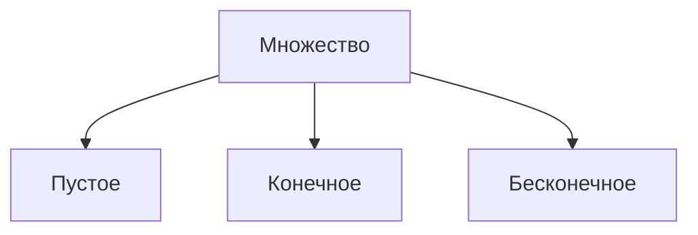

# Раздел 0. Множества. Функции.
## Лекция №1 Введение в курс.

Лекция №1 от 16.09.2025
Лектор: Башуров Вячеслав Владимирович

Множество
<u>опр.</u>
• Под множеством понимается ”набор”, ”коллекция”,
”совокупность” и т.п. объектов, объединенных каким-либо общим свойством.

• Предметы или объекты, составляющие множество,
называются элементами множества.
Множества обозначают большими буквами А, В, С... , а их элементы а, b, с... — малыми буквами латинского алфавита.

• Если а — элемент множества А , то $a\in A$ и читают: ”а
принадлежит А” , в противном случае $a\notin A$ или $a\overline{\in} A$ и читают: ”а не принадлежит А”

<u>опр.</u>
• $A\subseteq B$ — множество А является подмножеством В множества ; при этом каждый элемент множества А является элементом множества В

• $A\subset B$ — множество А является собственным подмножеством множества В ; здесь существует хотя бы один элемент множества В, не принадлежащий множеству А

• $A= B$ — равны множества, если одновременно $A\subseteq B$ и $B\subseteq A$

• Множество, не содержащее ни одного элемента, называется пустым. Обозначается $\varnothing$

<u>Свойства:</u>
1. пустое множество $\varnothing$ является собственным подмножеством всякого не пустого множества, т.е. $\varnothing\subset B$
2. любое множество — несобственное подмножество самого себя $B\subseteq B$
3. для произвольных множеств А, В, С если $A\subseteq B$ и $B\subseteq C$ , то $A\subseteq C$

• **Задать множество** можно либо перечислением **всех** его элементов, либо указанием **характеристического** свойства элементов множества. Например, множество А = {+; - ; 1; 0} — задано перечислением его четырех элементов.
Множество $X =\{x\in\mathbb{N}:x^2=1\}$ состоит из натуральных чисел, **таких, что** квадрат этих чисел равен единице, т.е. Х = {1}

Числовые множества
<u>опр.</u>
$\mathbb{N}=\{1,2,3\ldots n,\ldots\}=\{n\}^{\infty}_{n=1}$ - множество **всех** натуральных чисел
$\mathbb{Z}=\{\ldots,-3,-2,-1,0,1,2,3\ldots\}=\{n\}^{\infty}_{n=-\infty}$ - множество **всех** целых чисел
$\mathbb{Q}=\bigg\{\frac{n}{m},n\in\mathbb{Z},m\in\mathbb{N},НОД\{|n|,m\}=1\bigg\}$ - множество всех рациональных чисел
$\mathbb{I}$ - множество всех иррациональных чисел
$\mathbb{R}=(-\infty,+\infty) = \mathbb{Q}+ \mathbb{I}$ - множество всех действительных чисел

Операции над множествами
1. Объединение (сумма) $A\cup B=\{x:x\in A\text{ или }x\in B\}$
2. Пересечение (произведение) $A\cap B=\{x:x\in A\text{ и }x\in B\}$
3. Разность $A\backslash B=\{x:x\in A\text{ и }x\notin B\}$

Свойства операций над множествами
ыы

Классификация множеств

<u>опр.</u>
Пусть Х и Y - два непустых множеств. Если существует отображение (закон) f такой, что:
1. всякому x in Х соответствует образ y = f(x) in Y;
2. всякому y in y соответствует прообраз x такой, что  f(x) = y;
3. различные x1 и x2 (x1 $\neq$ x2) соответствуют несовпадающие образы,
то говорят, что правило f: X -> Y определяет взаимно-однозначное соответствие между множествами X и Y; при этом множества называют **эквивалентными** и записывают Х ~ Y

<u>опр.</u>
Множество Х - **конечное**, если существует натуральное число k, такое, что X ~ {1, 2, 3, ..., k} = Nk.

<u>опр.</u>
Множество X - **бесконечное**, если оно не является конечным, т. е. для любого натурального числа k множество X не эквивалентно множеству $N_{k}$.

<u>опр.</u>
Количественная характеристика всякого бесконечного множества, обобщающая понятие количества элементов конечного множества, - **МОЩНОСТЬ** множества.

<u>опр.</u>
Бесконечное множество называется **счётным**, если оно эквивалентно множеству всех натуральных чисел
(X - бесконечное счётное) $\iff$ (X~N)

<u>опр.</u>
Бесконечное множество, не являющееся счётным, называется **несчётным**. Среди несчётных множеств выделяем те из них, которые эквивалентны (равномощны) множеству всех чисел промежутка (0;1)
Всем несчётным множествам, эквивалентным множеству (0;1), сопоставляется символ $\mathfrak{c}$  - мощность "континуум".

Понятие числовой последовательности

<u>опр.</u>
Если каждому натуральному числу n поставлено в соответствие по определённому число x in X, то говорят, что задана числовая последовательность $\{x_{n}\}$.

Понятие функции

<u>опр.</u>
Функцией f, действующей из множества X в множество У, называется правило, по которому каждому элементу множества Х ставится в соответствие единственный элемент множества У. При этом множество Х называется **областью определения** функции f (обозначается D(f)), а множество У называется **областью значений** функции f (обозначается E(f)).

Способы задания функции

<u>опр.</u>
Если задана функция f, которая определена на множестве Х и принимает значения в множестве У, то есть, функция f отображает множество Х в Y, то f: X-> Y или X -f-> Y

1. **Аналитический способ**
Функция задаётся в виде одной или нескольких формул или уравнений

2. **Графический способ**
Числовые функции можно также задавать с помощью графика

3. **Табличный способ**
Числовые функции можно также задавать с помощью ряда значений аргумента и соответствующих значений функции.

Cвойства функции
1. **Возрастание и убывание**
Пусть дана функция y = f(x), тогда
- функция f называется неубывающей на X, если $\forall x_1, x_2, \in X: x_1 > x_2 \implies f(x_1) \geq f(x_2)$
- функция f называется возрастающей на X, если $\forall x_1, x_2, \in X: x_1 > x_2 \implies f(x_1) > f(x_2)$
- функция f называется невозрастающей на X, если $\forall x_1, x_2, \in X: x_1 > x_2 \implies f(x_1) \leq f(x_2)$
- функция f называется убывающей на X, если $\forall x_1, x_2, \in X: x_1 > x_2 \implies f(x_1) < f(x_2)$

<u>опр.</u>
Возрастающая или убывающая функция называется строго монотонной.

2. **Периодичность**
Пусть дана функция y = f(x), тогда функция y = f(x) называется периодической с периодом T != 0, если справедливо: $f(x+T) = f(x), \forall x \in X$

<u>опр.</u>
Наименьший положительный период, если он существует, называется основным периодом.

<u>опр.</u>
Если это равенство не выполнено, то функция f называется апериодической.

3. **Чётность**
Пусть дана функция y = f(x), тогда
- функция f: X -> R называется нечётной, если справедливо равенство: $f(-x) = -f(x), \forall x \in X$
- функция f: X -> R называется чётной, если справедливо равенство: $f(-x) = f(x), \forall x \in X$

<u>опр.</u>
Если не выполнено ни одно из этих равенств, то функция называется функцией общего вида.

4. **Ограниченность**
Пусть дана функция y = f(x), тогда
-  функция y = f(x) называется ограниченной сверху в области определения Х, если существует число М такое, что выполняется неравенство: $f(x) \leq M, \forall x \in X$
-  функция y = f(x) называется ограниченной снизу в области определения Х, если существует число М такое, что выполняется неравенство: $f(x) \geq M, \forall x \in X$

<u>опр.</u>
Функция y = f(x) называется ограниченной, если она ограничена и сверху, и снизу

Гиперболические функции

**Гиперболический синус:**
$$\boxed{
sh (x) = \frac{e^{ x }-e^{ -x }}{2}}
$$
**Гиперболический косинус:**
$$\boxed{
ch (x) = \frac{e^{ x }+e^{ -x }}{2}}
$$

Обратная функция
<u>опр.</u>
Пусть задана функция y = f(x) c областью определения D и множеством значений E. Если каждому y in E соответствует единственное значение x in D, то определена функция x = g(y) = f  (y), которая называется обратной к функции f(x)

<u>опр.</u>
Чтобы найти функцию x = g(y), обратную к функции y = f(x), достаточно просто решить уравнение f(x)=y относительно x (если это возможно)

<u>опр.</u>
Функция y = f(x) имеет обратную тогда и только тогда,  когда функция f(x) задаёт взаимно-однозначное соответствие между множествами D и E.

<u>опр.</u>
Любая строго монотонная функция имеет обратную.

---
# Раздел 1. Предел последовательности. Предел функции.
## Лекция №2 Числовые множества. Числовые последовательности.

Лекция №2 от 23.09.2025
Лектор: Башуров Вячеслав Владимирович

Свойства числовых множеств
1. Множество всех действительных чисел $\mathbb{R} = (-\infty , \infty)$ - бесконечное, мощности $\mathfrak{c}$

2.  $\mathbb{R} = \mathbb{Q} \cup \mathbb{I};\mathbb{N} \subset \mathbb{Z} \subset \mathbb{Q} \subset \mathbb{R}$

3. Между  $\mathbb{R}$ и точками числовой оси существует взаимно-однозначное соответствие, поэтому термины "точка" и "действительное число" взаимозаменяемы и, значит, числовые промежутки можно представлять геометрическими отрезками (с концами или без концов)

4. Если а и b  - произвольные действительный числа, то либо а=b, либо а<b, либо а>b, причём  если а<b, то b>a, а также a<b и b<c, то а<c (свойство упорядоченности)

5. Для любых различных действительных чисел найдётся действительное число "между" ними, например их полу сумме, т. е. $\forall a,c \in \mathbb{R}, (a<c) \implies (\exists b\in \mathbb{R}: a<b<c)$ или $\forall a,c \in \mathbb{R}, (a>c) \implies (\exists b\in \mathbb{R}: a>b>c)$ (свойство плотности)

6. Пусть X - произвольное числовое множество, $X \subset \mathbb{R}$
(X - ограничено сверху) $\iff (\exists M \in \mathbb{R}: \forall x\in X, x\leq M)$
(X - ограничено снизу) $\iff (\exists m \in \mathbb{R}: \forall x\in X, m\leq x)$
(X - ограниченное) $\iff (\exists m,M \in \mathbb{R}: \forall x\in X, m\leq x\leq M)$
Чаще всего отрезок $[m,M]$ берётся симметрично х=0, т.е.
(X - ограниченное) $\iff (\exists K \in \mathbb{R}, K > 0: \forall x\in X. |x|\leq M)$
(X - неограниченное) $(\forall K > 0: \exists x_k \in X: \forall |x_k|>K)$

Грани числовых множеств

<u>опр.</u>
Если множество ограничено сверху, то говорят, что множество имеет "верхнюю границу", т.е.
$$
\exists b\in \mathbb{R}: \forall x\in X\to x\leq b
$$
(•)
Множество всех верхних границ {b} - бесконечное

<u>опр.</u>
Наименьшая из верхних границ множества X называется точной верхней гранью множества или его ВЕРХНЕЙ ГРАНЬЮ и обозначается supX ("супремум множества Х"), т.е.

(supX = b) <=> (b - верхняя граница множества X; b - наименьшая верхняя граница множества X), т.е.
$$
(\text{sup} X = a) \iff (\forall x \in X; x\leq b; \forall \varepsilon> 0, \exists x_{\varepsilon} \in X: b - \varepsilon<x_{\varepsilon})
$$

<u>опр.</u>
Для ограниченного снизу множества Х вводится понятие нижней грани множества Х - inf X ("инфинум множества Х"), т.е.
$$
(\text{inf} X = a) \iff (\forall x \in X; a\leq x; \forall \varepsilon> 0, \exists x_{\varepsilon} \in X: x_{\epsilon} < a + \varepsilon)
$$

Числовая последовательность

<u>опр.</u>
Числовая последовательность - это взаимно-однозначаное соответствие множества натуральных чисел N некоему множеству действительных чисел X с элементами $x_{n}$, где n в N. $x_{n}$- общий член последовательности $\{x_{n}\}$.

<u>опр.</u>
Последовательность $\{x_{n}\}$ называется ограниченной, если существует такое число М>0, что для любого n in N выполняется неравенство: $|x_n|\leq M$

<u>опр.</u>
Последовательность $\{x_{n}\}$ называется монотонной, если для всех n in N выполнено неравенство: $(x_{n+1} \geq x_n)\cup (x_{n+1} \leq x_n)$

Способы задания числовой последовательности

1. Перечислением элементов $\{x_{n}\}$ = {1,-1,1,-1,...}

2. Через общий член $\{x_{n}\}$ = 1/n^2

3. Рекуррентным соотношением $x_{n+1} = f(x_n)$ с заданным значением, например, x1

<u>опр.</u>
Выбрасывая из последовательности конечное или бесконечное число членов (так, чтобы оставалось бесконечное число в последовательности всё равно), получаем новую последовательность, называемую подпоследовательностью.

<u>опр.</u>
Последовательность $\{x_{n}\}$ называется сходящейся, если существует такое число A, что для любого положительного Е найдётся такой номер N, что для всех n > N выполняется неравенство |Xn - A| < E

<u>опр.</u>
Если такого числа нет, то последовательность называется расходящейся.

<u>опр.</u>
Число A называется пределом последовательности $\{x_{n}\}$ и обозначается:

<u>Теорема.</u>
Если две последовательности $\{x_{n}\}$ и $\{y_{n}\}$ имеют соответственные пределы a и b, то
1. $\lim\limits_{n\to\infty}{(x_n\pm y_n)} = a \pm b$
2. $\lim\limits_{n\to\infty}{(x_n \cdot y_n)} = a \cdot b$
3. $b\neq 0$, тогда $\lim\limits_{n\to\infty}{(\frac{a}{b})} = \frac{a}{b}$

<u>Теорема.</u>
Если для трёх последовательностей $\{x_{n}\}$, $\{y_{n}\}$ и $\{z_{n}\}$ справедливо неравенство $\{x_{n}\}$ < $\{y_{n}\}$ < $\{z_{n}\}$ и последовательности $\{x_{n}\}$ и $\{z_{n}\}$ сходятся к одному и тому же пределу А, то и последовательность $\{y_{n}\}$ сходится к пределу А.

<u>Теорема.</u>
Если последовательность $\{x_{n}\}$ сходится к пределу А, то любая её подпоследовательность сходится к тому же пределу А.

<u>Теорема Вейерштрасса.</u>
Всякая монотонная ограниченная последовательность имеет предел.

---
## Лекция №3 Предел функции.

Лекция №3 от 30.09.2025
Лектор: Башуров Вячеслав Владимирович

Предел функции

![[Modest/Учёба/Математический анализ/Рисунки/рис. 1|рис. 1]]
Множество $\{ x\in \mathbb{R} : | x-x_0 | < \varepsilon \} = S_{\varepsilon}(x_0)$ - окрестность конечной точки $x_0, x_0 \in \mathbb{R}$, радиуса $\varepsilon, \varepsilon > 0$ (сокращенно $S_{\varepsilon}(x_0)  - \varepsilon \text{ - окрестность точки } x_0$); очевидно, что $S_{\varepsilon}(x_0)  = (x_0 - \varepsilon, x_0 + \varepsilon)$

![[Modest/Учёба/Математический анализ/Рисунки/рис. 2|рис. 2]]
Множество $\{ x\in \mathbb{R} : 0 < | x-x_0 | < \varepsilon \} = (x_0 - \varepsilon, x_0 + \varepsilon) \backslash \{x_0\}$ будем называть "выколотой" или "проколотой" $\dot{S_{\varepsilon}}(x_0)  - \varepsilon \text{ - окрестность точки } x_0$ очевидно, что $\dot{S_{\varepsilon}}(x_0)  = (x_0 - \varepsilon, x_0)\cup (x_0, x_0 + \varepsilon)$

![[Modest/Учёба/Математический анализ/Рисунки/рис. 3|рис. 3]]
Множество $\{ x\in \mathbb{R} : |x| > \varepsilon \} = S_{\varepsilon}(\infty)  - \varepsilon$ окрестность бесконечности; расширяем множество всех действительных чисел символов бесконечности, создавая возможность $x\to\infty$ очевидно, что $S_{\varepsilon}(\infty) = (-\infty, -\varepsilon) \cup (\varepsilon,\infty)$

<u>опр.</u>
Точка х0 называется предельной точкой множества
если в любой её окрестности содержится хотя бы одна точка из множества Х, отличная от х0, т.е.
(х0 - предельная точка для Х)

(•)
Предельная точка может принадлежать множеству, а может и не принадлежать ему.

**Например:**
Для Х = (0;1] каждая его точка предельная, причём х0 = 0 также предельная точка этого множества, но $0\notin (0;1]$

<u>опр.</u>
Определение предела функции по **Коши**.
Пусть $X \subset \mathbb{R}$, функция y = f(x) определена на Х, х0 - предельная точка множества Х: А - конечное число или бесконечность. Тогда
$\Big(A = \lim\limits_{x\to x_0} f(x)\Big)\iff (\forall \varepsilon > 0 ,  \exists \delta = \delta(\varepsilon)>0 : \forall x \in X: 0 < |x-x_0| < \delta \iff |f(x) - A| < \varepsilon )$

1. В определении предела функции в точке х0 не участвует, поэтому функции f(x) в точке х0 может быть не определена (не задана)

2. Функция...

<u>опр.</u>
Число А называют пределом функции f(x) при x -> в бесконечность, если $$
\Big(
A = \lim\limits_{x\to \infty} f(x)
\Big)
\iff (\forall \varepsilon > 0 ,  \exists \delta = \delta(\varepsilon)>0 : \forall x \in X: |x| > \delta \implies |f(x) - A| < \varepsilon )
$$
<u>опр.</u>
Функция называется бесконечно большой при x -> x0, если:
$$
\Big(
\infty = \lim\limits_{x\to x_0} f(x)
\Big)
\iff (\forall M > 0 ,  \exists \delta = \delta(M)>0 : \forall x \in X: 0 < |x-x_0| < \delta \implies |f(x)| > M)
$$

<u>опр.</u>
Функция называется бесконечно большой при x -> в бесконечность, если:
$$
\Big(
\infty = \lim\limits_{x\to \infty } f(x)
\Big)
\iff (\forall M > 0 ,  \exists \delta = \delta(M)>0 : \forall x \in X: |x| > \delta \implies |f(x)| > M)
$$

<u>опр.</u>
Число А называют пределом слева функции f(x) при x -> x0, если:
$$
\Big(
A = \lim\limits_{x\to x_0{-}} f(x)
\Big)
\iff (\forall \varepsilon > 0 ,  \exists \delta = \delta(\varepsilon)>0 : \forall x \in X: x_0-\delta <x< x_0 \iff |f(x) - A| < \varepsilon )
$$

<u>опр.</u>
Число А называют пределом справа функции f(x) при x -> x0, если:
$$
\Big(
A = \lim\limits_{x\to x_0{+}} f(x)
\Big)
\iff (\forall \varepsilon > 0 ,  \exists \delta = \delta(\varepsilon)>0 : \forall x \in X: x_0 <x< x_0+\delta \iff |f(x) - A| < \varepsilon )
$$

<u>опр.</u>
Определение предела функции по **Гейне**
Пусть f(x), x в X, х0 - предельная точка множества Х. Тогда:
$$
\Big(
A = \lim\limits_{x\to x_0}f(x)
\Big) \iff
\Big(
\forall (x_n)_{n=1}^{\infty} : \forall n, x_n \in X, x_n \neq x_0, \lim\limits_{n\to\infty}x_n = x_0 \implies \lim\limits_{n\to\infty}f(x_n) = A \Big)
$$
т.е. А есть предел функции при x->x0 тогда и только тогда, когда для всякой последовательности аргументов функции, состоящей из точек множества Х, отличных от х0 и сходящейся к х0, соответствующая последовательность значений функции имеет пределом А.

(•)
Определения предела по Коши и по Гейне эквивалентны.

<u>Теоремы:</u>
1. $\lim\limits_{x\to x_0} [f(x) \pm g(x)] = \lim\limits_{x\to x_0} f{x} \pm \lim\limits_{x\to x_0} g(x)$
2. $\lim\limits_{x\to x_0} [f(x) \cdot g(x)] = \lim\limits_{x\to x_0} f{x} \cdot \lim\limits_{x\to x_0} g(x)$
3. $\lim\limits_{x\to x_0} \Big[\frac{f(x)}{g(x)}\Big] = \frac{\lim\limits_{x\to x_0} f(x)} {\lim\limits_{x\to x_0} g(x)}$
---
## Лекция №4 Первый и второй замечательные пределы.

Лекция №4 от 23.09.2025
Лектор: Башуров Вячеслав Владимирович

Теоремы о пределах

<u>Теорема о пределе промежуточной функции</u>
Если функция f(x) заключена между двумя функциями u(x) и v(x), стремящимися к одному и тому же пределу, то f(x) также стремится к этому пределу, т.е. если $\lim\limits_{x\to x_0} u(x) = A$ и $\lim\limits_{x\to x_0} v(x) = A$  с условием $u(x) \leq f(x) \leq v(x)$, то: $\lim\limits_{x\to x_0} f(x) = A$

Первый замечательный предел
При вычислении пределов, содержащих тригонометрические функции, часто используется предел:
$$
\lim\limits_{x\to 0} \frac{\sin (x)}{x} = 1
$$
![[Modest/Учёба/Математический анализ/Рисунки/рис. 4|рис. 4]]
Второй замечательный предел
Как известно из теории числовых последовательностей
$$
\lim\limits_{n\to \infty} \Big(1 + \frac{1}{n}\Big)^n = e
$$
Проверим, верно ли 
$$
\lim\limits_{x\to \infty} \Big(1 + \frac{1}{x}\Big)^x = e
$$
Пусть $$
x\to +\infty
$$
Можно заметить, что каждое значение x заключено между натуральными числами $$
n\leq x \leq n + 1
$$$$
\frac{1}{n+1} \leq \frac{1}{x} \leq \frac{1}{n}
$$
Следствия 1-ого и 2-ого замечательных пределов

**Предел**:
$\lim\limits_{x\to 0} \frac{\sin x}{x} = 1$
**Следствия**:
1) $\lim\limits_{x\to 0} \frac{\tan x}{x} = 1$
2) $\lim\limits_{x\to 0} \frac{\arcsin x}{x} = 1$
3) $\lim\limits_{x\to 0} \frac{\arcsin x}{x} = 1$
4) $\lim\limits_{x\to 0} \frac{1 - \cos x}{\frac{x^2}{2}} = 1$

**Предел:**
$\lim\limits_{x\to \infty} \Big(1 + \frac{1}{x}\Big)^x = e$    или    $\lim\limits_{x\to 0} (1 + x)^{\frac{1}{x}} = e$
**Следствия:**
1) $\lim\limits_{x\to 0} \frac{e^x -1}{x} = 1$
2) $\lim\limits_{x\to 0} \frac{a^x -1}{x\cdot \ln (a)} = 1$
3) $\lim\limits_{x\to 0} \frac{\ln (1+x)}{x} = 1$
4) $\lim\limits_{x\to 0} \frac{\log_a (1+x)}{x\cdot \log_a (e)} = 1$
5) $\lim\limits_{x\to 0} \frac{(1+x)^k - 1}{k\cdot x} = 1$
6) $\lim\limits_{x\to \infty} \Big(1 + \frac{m}{x}\Big)^{xn} = e^{mn}$
7) $\lim\limits_{x\to 0} (1 + x )^{\frac{1}{x}} = e$

Бесконечно малые функции
<u>опр.</u>
Функция y = f(x) называется бесконечное малой при x -> x0 если:
- $\lim\limits_{x\to 0} f(x) = 0$
- $(\lim\limits_{x\to 0} f(x) = 0 ) \iff (\forall \varepsilon > 0, \exists \delta = \delta (\varepsilon) > 0: \forall x: 0 < |x-x_0| < \delta \implies |f(x)| < \varepsilon)$

<u>Теорема.</u>
Алгебраическая сумма конечного числа бесконечно малых функций есть бесконечно малая функция.

<u>Теорема.</u>
Произведение ограниченной функции на бесконечно малую функцию есть бесконечно малая функция.

<u>Теорема.</u>
Частное от деления бесконечно малой функции на функцию, имеющую отличный от нуля предел, есть бесконечно малая функция.

<u>Теорема.</u>
Если f(x) - бесконечно малая функция ( f(x) не равна 0), то функция 1/f(x) есть функция бесконечно большая. И наоборот: если f(x) - бесконечно большая функция, тогда 1/f(x) есть функция бесконечно малая.

Связь между функцией её пределом и бесконечно малые функции
<u>Теорема.</u>
Если f(x) имеет предел, равный А, то функцию можно представить в виде f(x) = A + a(x), где а(x) - бесконечно малая функция: $\lim\limits_{x\to x_0} f(x) = А$

<u>Теорема (Обратная).</u>
Если f(x) можно представить в виде f(x) = A + a(x), где а(х) - бесконечно малая функция, то число А является пределом функции $\lim\limits_{x\to x_0} f(x) = А$

Сравнение бесконечно малых функций
<u>опр.</u>
Пусть а(х) и b(x) бесконечно малые функции при х -> x0, т.е. $\lim\limits_{x\to x_0} \alpha(x) = 0$ и $\lim\limits_{x\to x_0} \beta(x) = 0$, тогда:
1) если $\lim\limits_{x\to x_0} \frac{\alpha(x)}{\beta(x)} = A, A \neq 0$ , то а(х) и b(x) - бесконечно малые одного порядка.
2) если $\lim\limits_{x\to x_0} \frac{\alpha(x)}{\beta(x)} = 0$ , то а(х) - бесконечно малая более высокого порядка, чем b(x)
3) если $\lim\limits_{x\to x_0} \frac{\alpha(x)}{\beta(x)} = \infty$, то а(х) - бесконечно малая более низкого порядка, чем b(x)
4) если $\lim\limits_{x\to x_0} \frac{\alpha(x)}{\beta(x)} = 1$, то а(х) и b(x) - эквивалентные бесконечно малые функции: a(x) ~ b(x)

<u>Теорема.</u>
Предел отношения двух бесконечно малых функций не изменится, если 
каждую или одну из них заменить эквивалентной ей бесконечно малой.

Таблица эквивалентных бесконечно малых функций
 При $x\to{0}$ справедливо:
 1. $\sin (x) \sim x$
 2. $\tan (x) \sim x$
 3. $\arcsin (x) \sim x$
 4. $\arctan (x) \sim x$
 5. $1 - \cos(x) \sim \frac{x^2}{2}$
 6. $e^x - 1 \sim x$
 7. $a^x - 1 \sim x\cdot \ln(a)$
 8. $\ln(1+x) \sim x$
 9. $\log_a(1+x) \sim x\cdot \log_a(e)$
 10. $(1+x)^k - 1 \sim k\cdot x, k>0$
 11. $\sqrt{1+x} - 1 \sim \frac{x}{2}$
 ---
# Раздел 2. Непрерывность функции.
## Лекция №5 Не

Лекция №4 от 23.09.2025
Лектор: Башуров Вячеслав Владимирович

Непрерывность функции в точке 

<u>опр.</u>
Пусть функция f(x) задана на (а,b), $x_{0}$ in (a,b). Тогда:

( f(x) - непрерывна в точке $x_{0}$) $\iff\bigg[\Big( \exists \lim\limits_{x\to x_0} f(x) \Big)\land \Big(\lim\limits_{x\to x_0} f(x) = f(x_0) \Big)\bigg]$

Непрерывность в точке функции предполагает задание функции в самой точке $x_{0}$ (конечная точка) и в некоторой её окрестности, при это должны выполняться условия:

1. Существование конечного предела функции в конечной точке

2. Значение предела совпадает со значением функции в этой точке

Различные определения непрерывности функции в точке

Эквивалентность определений либо следует из эквивалентности определений конечного предела функции, либо может быть установлена.

Пусть $\forall f(x), x \in (a,b), x_0 \in (a,b)$
Тогда эквивалентны следующие определения непрерывности функции в точке.

1) **Определение через пределы:** 
   (f(x) - непрерывна в точке) $\iff\bigg[\Big( \exists \lim\limits_{x\to x_0} f(x) \Big)\land \Big(\lim\limits_{x\to x_0} f(x) = f(x_0) \Big)\bigg]\iff\Big(\exists \lim\limits_{x \to x_0} f(x) = f(\lim\limits_{x\to x_0} x)\Big)$

2) **Определение по Коши** (на языке $\varepsilon - \delta$): 
   (f(x) - непрерывна в точке) $\iff (\forall \varepsilon > 0, \exists \delta = \delta(\varepsilon) > 0: \forall x, |x-x_0| < \delta \implies |f(x) - f(x_0)| < \varepsilon)$

3) **Определение через приращения.** Обозначим $x-x_0=\Delta x$ - приращение аргумента, $f(x)-f(x_0)=\Delta f(x_0)$ - приращение функции в точке $x_{0}$ соответствующее $\Delta x$. Тогда: 
   ( f(x) - непрерывна в точке) $\iff\big(\lim\limits_{\Delta x \to 0} \Delta f(x_0) = 0 \big)$

4) **Определение по Гейне** (через последовательности)
   (f(x) - непрерывна в точке) $\iff\big(\forall (x_n)^{\infty}_{n=1} : \forall n, x_n \in (a,b), \lim\limits_{n\to\infty} x_n = x_0 \implies \lim\limits_{n\to\infty} f(x_n) f(x_0)\big)$

5)  **Определение через односторонние пределы:**
   (f(x) - непрерывна в точке) $\iff\bigg[\Big( \exists \lim\limits_{x\to x_0 ^{-0}} f(x) \Big)\land\Big( \exists \lim\limits_{x\to x_0 ^{+0}} f(x) \Big)\land\Big( f(x_0) = \lim\limits_{x\to x_0 ^{-0}} f(x) = \lim\limits_{x\to x_0 ^{+0}} f(x) \Big)\bigg]$

Понятие точки разрыва функции
![[Modest/Учёба/Математический анализ/Рисунки/рис. 5|рис. 5]]
<u>опр.</u>
Пусть f(x), x in $[a,b]$, x0 in (a,b). Тогда если точка x0 не является точкой непрерывности функции f(x), то она - точка разрыва функции. При x0 = a или x0 = b также возможен "разрыв" слева или справа функции f(x), если рассматривается на $[a,b]$

Классификация точек разрыва
1. $\exists \lim\limits_{x\to x_0} f(x)$, но $\lim\limits_{x\to x_0} f(x) \neq f(x_0); x = x_0$ - точка устранимого разрыва
2. $\exists \underbrace{\lim\limits_{x\to x_0}}_{x<x_{0}} f(x) = f(x_0 - 0), \exists \underbrace{\lim\limits_{x\to x_0}}_{x>x_{0}} f(x) = f(x_0 + 0)$, но
- $f(x_0 - 0) \neq f(x_0 + 0); x = x_0$ -  точка разрыва первого рода;
- $|f(x_0 - 0) \neq f(x_0 + 0)|$ - скачок функции в точке x0;
3. x = $x_{0}$ - точка разрыва второго рода в остальных случаях.

Непрерывность функции в точке

<u>Теорема.</u>
Если функция f и g непрерывны в точке x0, то непрерывны в точке x0 и функции $f \pm g, f \cdot g$, а также функция $\frac{f}{g}$ если g(x) != 0

<u>опр.</u>
Пусть даны две функции f: X-> Y g: Y->Z функция h: X -> Z, определяемая равенством h(x) = g(f(x)), называется сложной функцией от f и g (или суперпозицией функций f и g)

<u>Теорема.</u>
Если функция y = f(x) непрерывна в точке x0, а функция g(y) непрерывна в точке y0 = f(x0), то сложная функция h(x)  = g(f(x)) непрерывна в точке x0.

Непрерывность функции на множестве
<u>опр.</u>
Функция f(x), x in X, называется непрерывной на множестве Х, или говорят, что функция f(x) принадлежит множеству всех функций, непрерывных на множестве Х (сокр. $f(x) \in C_X$), если она непрерывна в каждой точке множестве Х.

<u>Теорема Вейерштрасса №1</u>
Всякая функция, непрерывная на сегменте, ограничена на нём, т.е. $\forall f(x), x\in [a,b]$
$$
(f(x) \in C_{[a,b]}) \implies (\exists K>0: \forall x \in [a,b], |f(x)| \leq K)
$$
![[рис. 6]]

<u>Теорема Вейерштрасса №2</u>
Наибольшее и наименьшее значения функции, непрерывной на сегменте, достигаются в некоторых точках этого сегмента, т.е.
$$

(f(x) \in C_{[a,b]} ) \implies \bigg[
\Big(
\exists p\in [a,b]: f(p) = \underset{[a,b]}{\text{sup}} f(x) 
\Big)
\land
\Big(
\exists q\in [a,b]: f(q) = \underset{[a,b]}{\text{inf}} f(x) 
\Big)
\bigg]
$$
![[Modest/Учёба/Математический анализ/Рисунки/рис. 7|рис. 7]]

<u>Лемма (о нуле непрерывной функции)</u>
Если
1) $f(x) \in C_{[a,b]}$
2) $f(a) \cdot f(b) < 0$
То $\exists c \in (a,b): f(c) = 0$
![[Modest/Учёба/Математический анализ/Рисунки/рис. 8|рис. 8]]

<u>Теорема Больцано-Коши (о промежуточном значении)</u>
Если
1) $f(x) \in C_{[a,b]}$
2) $f(a) = A \neq B = f(b)$
То для любого числа К, расположенного между числами А и В, найдётся значение аргумента с in (a,b) такое, что f(c) = K

<u>Замечание</u>
Для функции f(x), непрерывной на $[a,b]$, существует $[p,q]$ (или $[q,p]$) 
на концах которого функция достигает своих наименьшего и наибольшего значений $A = \text{inf} f(x)$ и $B = \text{sup} f(x)$ (для $[a,b]$)

По теореме Больцано-Коши всякое промежуточное между А и В число является значением f(x) в некоторой точке сегмента $[p,q]$, а значит, и $[a,b]$, т. е. непрерывная функция f(x) отображает сегмент $[a,b]$ в сегмент $[A,B]$

Обратная функция

Пусть дана функция f, отображающая множество Х на множество Y:
f: X -> Y
Определим обратное соответствие f^-1: Y -> X, которое может быть функцией x = f^-1(y) (однозначное соответствие) или не быть.

<u>Теорема.</u>
Если функция f: X -> Y строго монотонная на множестве Х, то обратное соответствие f^-1: Y -> X однозначное, т.е. будет обратной функцией и тоже строго монотонной.

<u>Теорема.</u>
Пусть функция y = f(x) определена, непрерывна и строго возрастает на $[a,b]$, f(a) = A, f(b) = B. Тогда f($[a,b]$) = $[A,B]$ и обратная функция x =$f^{-1}$ (y) определена, непрерывна и строго возрастает на отрезке $[A,B]$.
## Лекция №6
# Раздел 3. Дифференциальное исчисление функции одной переменной.
## Лекция №7 Производная функции.
## Лекция №8 Исследование функций.
# Раздел 4. Интегрирование функций одной переменной. Неопределенный интеграл.
## Лекция №9 Неопределённый интеграл.
## Лекция №12 Интегрирование по частям. Интегралы от дробно-рациональной функции.
## Лекция №11 Интегралы от тригонометрических функций.
# Раздел 5.  Определенный интеграл.
## Лекция №12 Определённый интеграл.
## Лекция №13 Методы вычисления определённого интеграла.
## Лекция №14 Приложение определённого интеграла.
## Лекция №15 Несобственные интегралы

