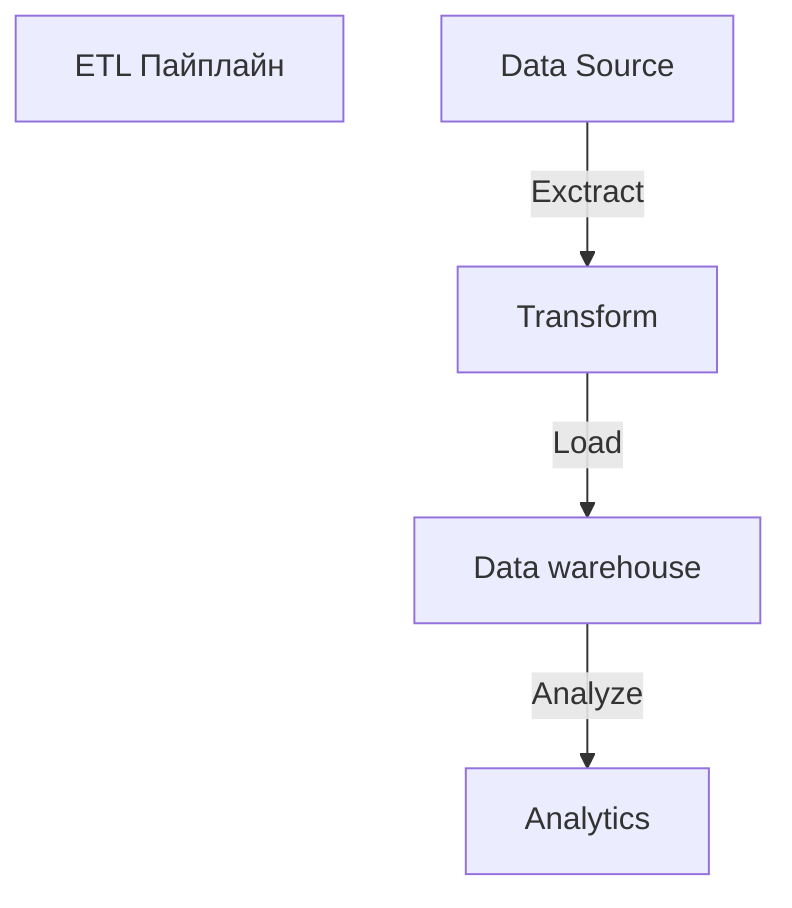
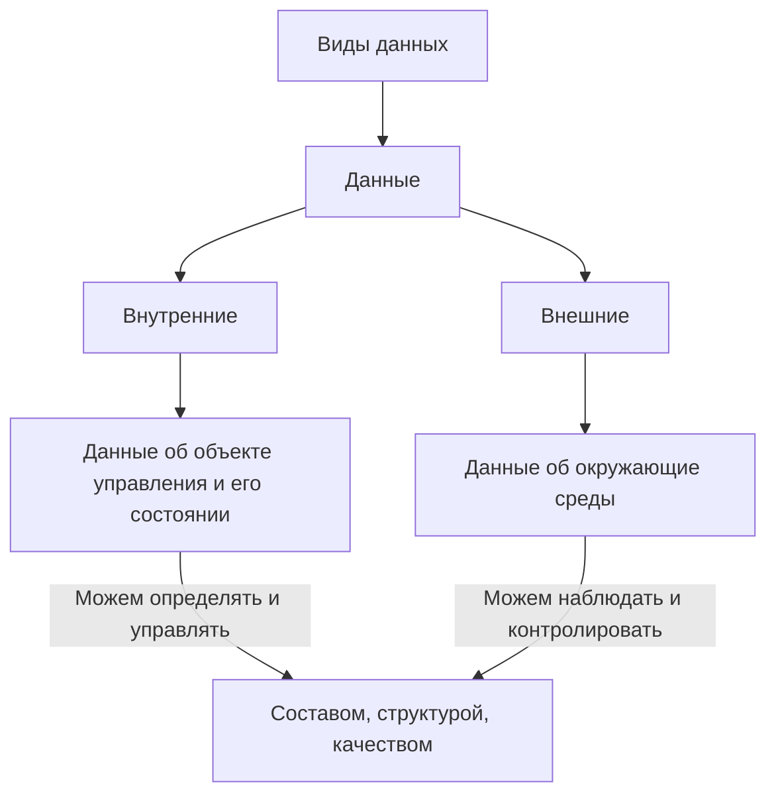
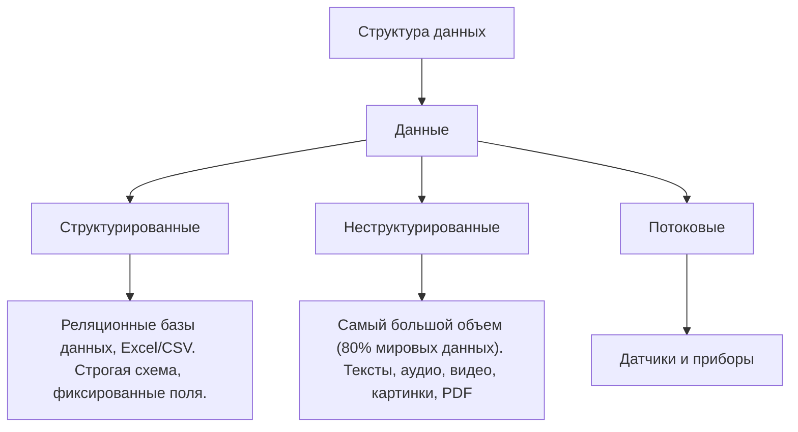
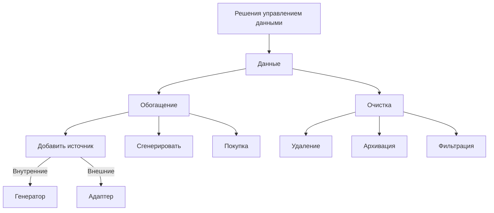
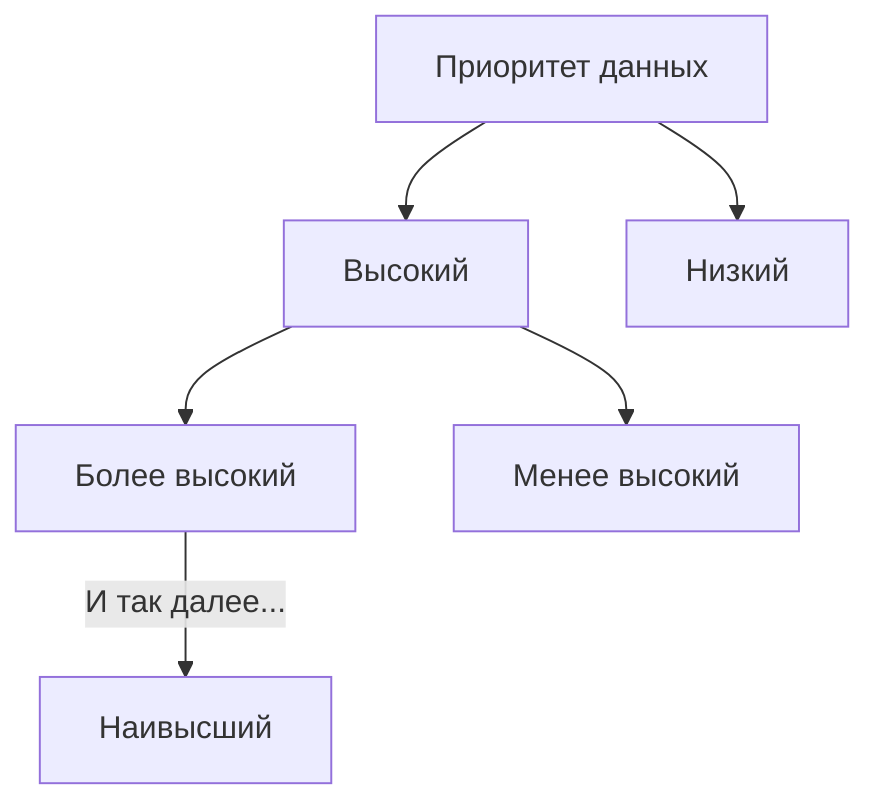

# <font color="#7fc7ff">Оценивание курса по БРС</font>
**Лекции:**
- Курс от Сбера "Python для анализа данных"
- Экзамен (если автомат, а автомат, если хакатон)

**Лабораторные:**
- Контрольная работа.
- Домашняя работа.

# <font color="#FFB100">Как и зачем собирать данные?</font> 
$\color{magenta}\text{Лекция №1}$

<font color="#9900ff"><u>опр. 1</u></font>
**Данные (общ.)** - это сведения, показатели, совокупность информации, характеризующие кого-либо или что-либо и служащие для каких-либо выводов и решений. 

<font color="#9900ff"><u>опр. 2</u></font>
**Данные (тех.)** - пассивная часть программного обеспечения, совокупность значений определённых ячеек памяти, преобразование которых осуществляет код (алгоритм).

<font color="#9900ff"><u>опр. 3</u></font>
**Данные (аналит.)** -  наблюдения, количественные показатели, описание или результаты исследований. 

(•)
Сбором данных занимается дата инженер с помощью ETL

<font color="#9900ff"><u>опр. 4</u></font>
**ETL** - Extract, Transform, Load (извлечение, преобразование, загрузка), процесс обработки данных из 3 этапов





4 Уровня аналитики

1. Дескриптивная аналитика (данные, показывающие текущее состояние) - 
   Что происходит? 
2. Диагностическая аналитика (данные, показывающие почему именно так) - 
   Почему? Исторические данные, A/B-тестирование, эксперимент
3. Предиктивная аналитика - что будет?
   Прогнозирующая, предсказательская, прорицающая, угадывающая 
4. Перспективная  аналитика - что делать? 

# <font color="#FFB100">Источники и методы сбора данных</font> 
$\color{magenta}\text{Лекция №2}$







<font color="#60d6a7">Характеристики источников и наборов данных:</font>
- Объём - определяет полноту, стоимость хранения и обработки данных.
<font color="#9900ff"><u>опр. 1</u></font>
**Data Lake** («озеро данных») — это централизованное хранилище, в котором можно сохранять структурированные, полуструктурированные и неструктурированные данные в исходном виде. В отличие от классических хранилищ, Data Lake позволяет загружать информацию без предварительной обработки, что упрощает интеграцию разных источников данных.

- Разнообразие - помогает объективно оценить данные, но требует разных форматов и методов обработки
- Скорость передачи данных - важна, чтобы получить  нужные данные вовремя

Решения управления данных:
1. Обогащение данных $\to$ добавить источники





<font color="#FFB100">Приоритеты данных</font> 
1. Тыкнуть пальцем в небо??
<font color="#9900ff"><u>опр. 2</u></font>
**Метод Монте-Карло** — термин, который означает **группу численных методов для изучения случайных процессов**. Название происходит от района Монте-Карло в Монако, известного своими казино.
2. ЧУМ, ЛУМ 




<font color="#9900ff"><u>опр. 3</u></font>
**Матрица Эйзенхауэра** — это метод тайм-менеджмента, который помогает расставить приоритеты между задачами в зависимости от их срочности и важности. Визуально матрица выглядит как квадрат, разделённый на четыре поля (квадранта

Критерии данных высокого приоритета
1. Нужны немедленно
2. Повышают ценность
3. Разным задачам и командам требуются одинаковые данные
4. Краткосрочные потоковые данные

<font color="#9900ff"><u>опр. 4</u></font>
**AutoML** (Automated Machine Learning) — **автоматизированное машинное обучение**. Это процесс автоматизации сквозного процесса применения машинного обучения к задачам реального мира.

Критерии данных среднего приоритета
1. Дополнение для существующего набора данных, повышающих качество (85% $\to$ 87%)
2. Код обработки данных может использоваться повторно
3. Данные легкодоступны
4. Удобный API позволяет собрать данные за прошлые периоды


Критерии данных низкого приоритета
1. Аналитики уже имеют доступ к данным
2. Низкое качество данных
3. Необходимо извлечение и парсинг веб-страниц, социальных сетей и другие специфических источников данных.
4. Низкая вероятность использования данных

<font color="#FFB100">Методы сбора данных</font> 
1. Ручной сбор
2. Парсинг
3. Интеграция

```mermaid
flowchart TD
	O["Типы источников данных"] -->A
    A["Данные"] -->B["Внутренние"]
    A --> D["Внешние"]
    D -->F["Закрытые"]
    F -->["Чужие БД, Сайты с огр."]
	D -->Q["Открытые"]
	Q -->X[""]
	B -->V["Закрытые"]
	B -->Z["Открытые"]
	Z["Открытые"] -->T[""]
	V["Закрытые"] -->P[""]

    
```

<font color="#FFB100">Типы источников данных</font> 

|            | Открытые                               | Закрытые                           |
| ---------- | -------------------------------------- | ---------------------------------- |
| Внутренние | • CRM • ERP • MES                      | • Логи системы                     |
| Внешние    | • Kaggle • Hugging Face • GitHub • OSM | • Чужие БД • Сайты с ограничениями |


|            | +                             | -                            | Затраты |
| ---------- | ----------------------------- | ---------------------------- | ------- |
| Внутренние | Контроль управления качеством | Ограниченный объём и полнота | Низкие  |
| Внешние    | Масштаб и доступность         | Формат                       | Средние |
|            |                               | Ограниченный доступ          | Высокие |

