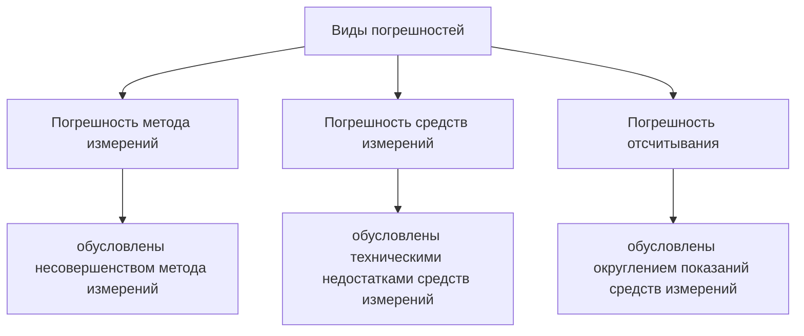

## Обозначения
Х – случайная физическая величина (её обозначение); 
х0 – истинное значение физической величины Х; 
х1, х2,……, хn – случайные значения измеряемой физической величины Х; 
n – число результатов наблюдений; 
$\bar{x}$ – среднее арифметическое значение физической величины Х; 
Р – вероятность; 
$S_{\bar{x}}$ – среднее квадратическое отклонение среднего арифметического; 
tp,n – коэффициент Стьюдента; 
ε – доверительная граница случайной погрешности результата измерения; 
θ – доверительная граница неисключённой систематической погрешности результата измерения; 
Δ – доверительная граница абсолютной погрешности результата измерения; 
γ – доверительная граница относительной погрешности результата измерения

# 1. Измерения физических величин. Погрешности измерений.

<u>опр. </u>
**Измерение физической величины** – это нахождение значения физической величины опытным путем с помощью специальных технических средств – приборов, установок и т.

<u>опр.</u>
**Прямое измерение** – измерение, при котором искомое значение величины получают непосредственно из опытных данных. Например, прямыми являются измерения массы с помощью весов, длины с помощью линейки и т.д.

<u>опр.</u>
**Косвенное измерение** – измерение, при котором искомое значение величины находят вычислением на основании известной зависимости между этой величиной и величинами, определяемыми в результате прямых измерений. Так, при определении плотности тела правильной формы проводят прямые измерения его массы, размеров, а затем уже рассчитывают плотность.

<u>опр.</u>
**Погрешностью измерения** - это отклонение результата измерения от истинного значения измеряемой величины. 

<u>опр.</u>
**Абсолютная погрешность **$\Delta_{0}$ – разность между измеренным $x$ и $x_{0}$ истинным значениями измеряемой величины:
$$
\Delta_{x}=x-x_{0}
$$

<u>опр.</u>
**Относительная погрешность** $\gamma_{0}$ - отношение абсолютной погрешности к истинному значению $x_{0}$ измеряемой величины:
$$
\gamma_{0}=\frac{\Delta_{0}}{x_{0}}
$$

<u>опр.</u>
**Случайная погрешность** – составляющая погрешности измерения, изменяющаяся случайным образом при повторных измерениях данной 6 величины.

<u>опр.</u>
**Систематическая погрешность** – составляющая погрешности измерения, остающаяся постоянной или закономерно изменяющаяся при повторных измерениях данной величины.

# 2. Оценка границ случайной погрешности прямого измерения

<u>опр.</u>
Наблюдение - отдельное измерение.

<u>опр.</u>
Результаты наблюдений - значения физической величины X, полученные в результате наблюдения.

<u>опр.</u>

(•)
Если считать, что систематические погрешности отсутствуют, то наиболее близким к неизвестному истинному значению $x_{0}$ этой величины является среднее арифметическое этих значений:
$$
\bar{x}=\frac{{x_{1}+x_{2}+\dots+x_{n}}}{n}
$$
А если количество устремить к бесконечности, то:
$$
\lim_{ n \to \infty } \bar{x}=x_{0}
$$
