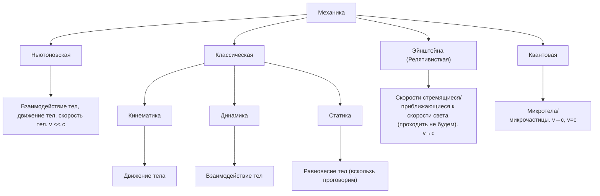
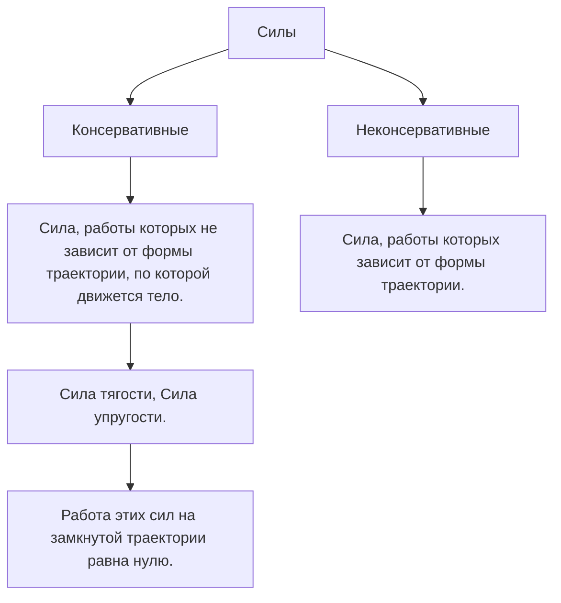
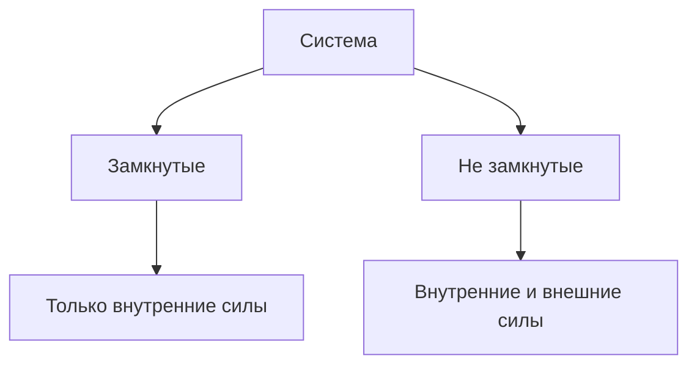

   #Физика
# Механика
## Предисловие

<u>Пон. 1</u>
Механическое движение - простейшее взаимодействие тел или материальных объектов.
<u>Пон. 2</u>
Материя - всё, что нас окружает.

## Кинематика. Кинематика поступательного движения.

<u>опр. 1</u>
**Кинематика** - раздел классической механики, в котором изучается движение простых тел без исследования причин, вызывающих это движение. Отвечает на вопрос как? Как двигается тело?

Характеристики движения:

<u>опр. 2</u>
Тело отсчёта (Т.О.) - реальное (чаще всего) физическое тело, относительно которого рассматривается движение в данной задаче. Тело отсчёта соответствует мерности пространства.

<u>опр. 3</u>
Система отсчёта (С.О.) - это тело отсчёта + система координат  + какой-либо способ измерения промежутков времени ("часы")

<u>опр. 4</u>
Инерциальная система отсчёта (И. С. О.) - такая система отсчёта, относительно которой тела движутся равномерно и прямолинейно. Выдумал Лоренц и поддержал Ньютон. Для нас это поверхность земли.

<u>опр. 5</u>
Траектория - реальная или воображаемая линия (набор точек), вдоль которой движется тело. 

(•) Тело заменяется на модель, модель называется материальной точкой.

<u>опр. 6</u>
Материальная точка - простейшая модель тела, в которой мы пренебрегаем почти всеми свойствами.

(•) Во вращательном движение будет модель, которая называется абсолютно твёрдое тело.

<u>опр. 7</u>
Абсолютно твёрдое тело - тело, размеры и формы которого в процессе вращения не меняются. 

<u>опр. 8</u>
Радиус-вектор точки ( $\vec{r}$ ) - вектор, с помощью которого задают положение материальной точки в пространстве (один из способов задания положения мат. точ.). Это вектор проведённый из начала координат в данную точку.
рисунок 1

![[Учёба/Физика/Рисунки/рис. 1|рис. 1]]

<u>опр. 9</u>
Перемещение ( $\vec{S}$ ) - векторная физическая величина, численно равная вектору соединяющая начальную и конечную точки перемещения. 
$$\vec{S}=\vec{r_2}-\vec{r_1}$$

<u>опр. 10</u>
Путь ( $l$ ) - скалярная физическая величина, характеризующая движения и численно равная расстоянию, пройдённому материальная точкой вдоль траектории.  
$l\geq |\vec{S}|$
$\vec{S}>0$ - всегда, если тело двигалось
$l$ может быть $= 0$

<u>опр. 11</u>
Скорость (мгновенная скорость) ( $\vec{v}$ )- векторная физическая величина, характеризующая быстроту перемещения материальной точки вдоль траектории.

$$\vec{v} =\frac{d\vec{r}}{dt}=\frac{d\vec{S}}{dt}$$
$$\bigg(|\vec{v}|=\frac{dx}{dt}\bigg)$$
![[Учёба/Физика/Рисунки/рис. 2|рис. 2]]

<u>опр. 12</u>
Средняя скорость
$$\langle\vec{v}\rangle =\frac{\delta \vec{r}}{\delta t}\frac{\delta \vec{S}}{\delta t}$$
<u>опр. 13</u>
Средняя путевая скорость - скалярная физическая величина.
$$v_{ср} = \frac{l}{\Delta T}$$

<u>опр. 13</u>
Ускорение (мгновенное ускорение) ( $\vec{a}$ )- векторная физическая величина, характеризующая быстроту изменения скорости. 
$$\vec{a}=\frac{d\vec{v}}{dt}=\frac{d^2 \vec{r}}{(dt)^2}=\frac{d^2 \vec{S}}{(dt)^2}$$
<u>опр. 14</u>
Среднее ускорение - векторная физическая величина.
$$\langle\vec{a}\rangle=\frac{\Delta\vec{v}}{\Delta t}$$

<u>опр. 15</u>
Полное ускорение
Так как ускорение характеризует изменение скорости по модулю и направлению, то полное ускорение складывается из двух составляющих: $$\vec{a}=\vec{a_n}+\vec{a_{\tau}}$$<u>опр. 16</u>
$\vec{a_n}$ - нормальное ускорение (от слова нормаль) - характеризует быстроту изменения скорости по направлению и направлена к центру окружности или центру окружности в отрезке криволинейного движения. (В школе называлось центростремительным)
$$\vec{a_n} =\frac{v^2}{R}$$
$R$ - радиус окружности

$$\vec{a_n} =\frac{v^2}{r_{кр}}$$
$r_{кр}$ - радиус кривизны траектории (!!)

<u>опр. 17</u>
$\vec{a}_{\tau}$ - тангенциальное ускорение (от слова тангенс), ещё называется касательное, характеризует быстроту изменения скорости по модулю и направлена по касательной к траектории 
$$a_{\tau}=\frac{dv}{dt}$$

![[Учёба/Физика/Рисунки/рис. 3|рис. 3]]

(!!) Посмотреть материал по равномерном движению по окружности 
$|\vec{v}| = const$     $a_n \to a_ц$
Равномерное и равнопеременное движение (формулы и графики) самостоятельно посмотреть, так как предполагается, что мы это уже знаем из школы.

## Динамика. Динамика поступательного движения.

<u>опр. 1</u>
**Динамика** - раздел классической механики, в котором изучается причину или причины движение тел, независимо от вида движения. Отвечает на вопрос почему? Почему двигается тело? Наличие силы - причина движения.

(•) - про деформацию говорить не будем

<u>опр. 2</u>
Сила ( $\vec{F}$ )- векторная физическая величина, характеризующая взаимодействие тел, в результате которого тела деформируются или приобретают ускорение.

<u>Характеристики силы.</u>
1. Точка приложения
2. Направлением
3. Модулем

Динамика основана на трёх законах Ньютона.

I. Закон Ньютона
Провозглашает существование инерциальных систем отсчёта, в которых тело либо покоится, либо движется равномерно прямолинейно. 

<u>опр. 3</u>
Инертность - способность тела, обладающего массой, сохранять скорость или менять её не скачком, а постепенно.

II. Закон Ньютона
$\vec{a}\sim \vec{F}$    $|\vec{a}|\sim\frac{1}{m}$
$$\boxed{
\vec{a}\sim \frac{\vec{F}}{m}
}$$
Следствие из II закона Ньютона: $\vec{F}=m\vec{a}$

III. Закон Ньютона
При взаимодействии тел или материальных точек возникают силы "действия" и "противодействия".
![[Учёба/Физика/Рисунки/рис. 5|рис. 5]]

<u>опр. 4</u>
Масса ( $m$ ) - скалярная физическая величина, характеризующая инертные свойства тела.

<u>опр. 5</u>
Импульс ( $\vec{p}$ ) - векторная физическая величина, характеризует количество движения, которым обладает тело с массой.
$$\vec{p}=m\vec{v}$$
Из второго закона Ньютона следствие:
$\vec{F}=m\frac{\vec{\Delta v}}{\Delta t}$     $F=m \frac{dv}{dt}$  
$\vec{F}dt=md\vec{v}$
$$
\underbrace {\vec{F}dt}_{\text{Импульс тела}}=\underbrace {d(m\vec{v})}_{\text{Изменение импульса тела}}
$$

<u>Силы в механике</u>
1. Сила тяжести - отвесная составляющая силы всемирного тяготения.
$$
\vec{F}_{\text{тяж.}}=m\vec{g}
$$
2. Сила упругости -  сила, возникающая в теле в результате деформации и стремящаяся вернуть его в исходное (начальное) состояние.
$$
F_{\text{упр.}}\sim\Delta x
$$
$$
F_{\text{упр.}}=-k\Delta x
$$
3. Сила трения - это сила, возникающая при соприкосновении двух тел и препятствующая их относительному движению
$$
F_{\text{тр.}}\sim N
$$
$$
F_{тр.}=\mu N
$$
4. Вес тела ($Q$) - сила, с которой тело давит на опору или растягивает подвес.
![[Учёба/Физика/Рисунки/рис. 4]]

$$
\boxed{\oint_{S}\vec{F}\vec{ds}=0}
 - \text{Формула для консервативных сил}$$ <u>опр. 6</u>
Работа сила - ...

## Работа силы тяжести.

$\text{Дано:}$
$m,F=mg$
$h_{1},h_{2}$

$A-?$

![[Учёба/Физика/Рисунки/рис. 6|рис. 6]]
На горизонтальном участке $dx$ работа силы тяжести равна нулю, так как $\angle\alpha$ равен $90^{\circ}$
$$А=\int_{h_{1}}^{h_{2}} F_{\text{тяж.}}dh=mg\int_{h_{1}}^{h_{2}}dh=mgh_{2}-mgh_{1}$$
т. к. $h_{2}<h_{1}$    $A=-(mgh_{1}-mgh_{2})=-\Delta mgh$
$$
A_{\text{{тяж.}}}=-\Delta E_{\text{п.}}
$$
$E_{\text{п.}}=mgh$ - потенциальная энергия тела, поднятого над землёй.

Работы силы тяжести = убыли потенциальной энергии.

<u>опр. 7</u>
Потенциальная энергия ( $E_{\text{п.}},W_{\text{п.}},W_{\text{р.}}$ ) - скалярная физическая величина, характеризующая состояние системы тел, определяется количеством тел в систем (их как минимум два). Выбором нулевого уровня. Потенциальная энергия может быть "+", "-" и "0".

(•) Потенциальная энергия - энергия взаимодействия тел. Изначально энергия отрицательная (пример с поднятием тела.)

## Связь консервативной силы и потенциальной энергии.
$$\underbrace{\delta A}_{\text{Элементальная работа}}=-dE_{\text{п.}}=\vec{F}d\vec{r}$$    $$\big(\vec{F_{x}}\vec{i}+\vec{F_{y}}\vec{j}+\vec{F_{z}}\vec{k}\big)\times(dx\vec{i}+dy\vec{j}+dz\vec{k})\implies F_{x}dx+F_{y}dy+F_{z}dz=-dE_{\text{п.}}$$
$$F_{x}dx=-dE_{\text{п.}}\to F_{x}=-\frac{dE_{\text{п.}}}{dx}$$
$$F_{y}dy=-dE_{\text{п.}}\to F_{x}=-\frac{dE_{\text{п.}}}{dy}$$
$$F_{z}dz=-dE_{\text{п.}}\to F_{z}=-\frac{dE_{\text{п.}}}{dz}$$

Действие силы приводит к перемещению (изменению координаты) и к изменению потенциальной энергии.
$$
\vec{F}=-\left(\frac{dE_{\text{п.}}}{dx}\vec{i}+\frac{dE_{\text{п.}}}{dy}\vec{j}+\frac{dE_{\text{п.}}}{dz}\vec{k}\right)
$$

Зайти на exam1 с 5 марта - 15 марта
Весенний семестр 2025/2026
зайти под фамилией ?? Горы
и выбрать свою команду, у всех кто учится у неё в пятницу первая строка, только команда 9 (не мы) у неё не учится
Раньше и позднее этого 
https://exam1.urfu.ru/user/profile.php?id=197144

Градиент - вектор направлен в сторону наиболее быстрого возрастания величины.

$$
\vec{F}=-grad\cdot E_{\text{п.}}
$$

## Закон изменения и сохранения импульса. 
<u>опр. 1</u>
Импульс ( $\vec{p}$ ) - векторная физическая величина, характеризующая меру механического движения.

<u>опр. 2</u>
Механическая система - сумма всех тел (могут быть и материальными точками), рассматриваемые в данной задаче.

<u>опр. 3</u>
Внутренний силы - силы взаимодействия между телами, входящими в систему.

<u>опр. 4</u>
Внешние силы - силы, действующие на тела системы из вне.

![[Учёба/Физика/Рисунки/рис. 7|рис. 7]]

Задача: вывести закон изменения, от от него сохранения, энергии.

$\vec{f}$ - внутренние силы
$N$ - количество тел в системе
$m$ - масса тел
$$
\vec{F_{\sum}}+\vec{f}=m\cdot \vec{a}=m_{\sum} \frac{\vec{dv}}{dt}
$$
$$
m_{i}\cdot  \frac{\vec{dv_{i}}}{dt}=\left( \vec{f_{i1}}+\vec{f_{iN}} \right)+\vec{F_{i}} +\dots=\sum^{N}_{i=1} \frac{\vec{dp_{i}}}{dt}=0+\sum_{i=1}^N \vec{F_{i}}
$$
(•) Согласно третьему закону Ньютона внутренние силы скомпенсированы

$\sum^N_{i=1} p_{i}=\vec{P}_{\text{системы}}$ - импульс системы тел.

(•) Изменить полный импульс системы могут только внешние силы.
$$
\color{Pink}\text{Закон изменения энергии}
$$
$$
\color{Pink}\boxed{\Delta \vec{P_{\text{сист.}}}=\sum \vec{F}_{внеш.}}
$$
Если система замкнута (стремимся сделать такую систему во всех задачах), то $$\sum \vec{F}_{\text{внеш.}}=0$$
$$
\Delta \vec{P_{\text{сист.}}}=0
$$
$$
\color{Pink}\text{Закон сохранения энергии}
$$
$$
\color{Pink}\boxed{\Delta \vec{P_{\text{сист.}}}=const}
$$
## Закон изменения и сохранения энергии. 

Система тел:
N - количество тел
$m_{i}$ - масса каждого тела
$v_{i}$ - скорость каждого тела
В системе действуют консервативные силы

По второму закону Ньютона:
$m_{1} \frac{\vec{dv_{1}}}{dt}=\left( \vec{f_{21}}+\dots+\vec{f_{N1}} \right) +F_{1}$    $| \cdot \vec{dr_{1}}$
$$
m_{1} \frac{\vec{dr_{1}}}{dt}\vec{dv_{1}}=\left( \vec{f_{21}}\cdot \vec{dr_{1}}+\dots+\vec{f_{N1}}\cdot \vec{dr_{1}} \right) +F_{1}\cdot \vec{dr_{1}}
$$
$$
\dots\dots\dots \text{Для каждого тела пишется аналогичное уранвнение}\dots\dots\dots
$$
(•) Согласно теореме о потенциальной энергии (о работе консервативных сил)
$$
m_{1}|\vec{v_{1}}| \vec{d|v_{1}|}=-dE_{\text{п.}} + dA_{\text{внеш. силы.}}
$$
$$
m_{1}v_{1} dv_{1}=-dE_{\text{п.}} + dA_{\text{внеш. силы.}}
$$
Берём интеграл от обеих частей уравнений
$$
\frac{\Delta m_{1}v^2}{2}=-\Delta E_{\text{п.}}+A_{\text{внеш. силы.}}
$$
$$
\color{Pink}\text{Закон изменения энергии}
$$
$$
\color{Pink}\boxed{A_{\text{внеш. силы.}} = \underbrace{\Delta E_{\text{п.}}+\Delta E_{\text{к.}}}_{\text{Полная мех. эн. системы}}}
$$

(•) Изменить полную механическую энергию системы могут только внешние силы.
$$
A_{\text{внеш. силы.}}=\Delta E
$$
Если система замкнута, то:
$$
A_{\text{внеш. силы.}}=0
$$
$$
\underbrace{\Delta E_{\text{п.}}+\Delta E_{\text{к.}}}_{\Delta E}=0
$$
$$
\color{Pink}\text{Закон сохранения энергии}
$$
$$
\color{Pink}\boxed{E =const}
$$

(•) В замкнутой консервативной системе полная механическая энергия постоянна.

## Вращательное движения материальной точки и твёрдого тела.

<u>опр. 1</u>
Вращательное движение тела - движение, при котором каждая точка тела движется по окружности (или, как частный случай, дуге окружности) при этом центры всех окружностей лежат на одной прямой.

<u>опр. 2</u>
Твёрдое тело - тело, расстояние между любыми точками которого постоянно.

$\boxed{1}$ Кинематика вращательного движения
![[Учёба/Физика/Рисунки/рис. 8|рис. 8]]
- ось вращения перпендикулярна плоскости тела.
- при вращения тела каждая точка совершает разное перемещение
- $S_{1}>S_{2}$,    $v_{2}>v_{1}$

<u>Характеристики вращательного движения</u>
1. Угловое перемещение (  $\vec{d\varphi} = d|\vec{\varphi}|=\varphi$  ) - векторная физическая величина, численно равная бесконечно малому углу поворота тела. Угловое перемещение направленно вдоль оси вращения таким образом, что если смотреть с конца вектора $\vec{d\varphi}$ вращение тела будет против часовой стрелки. 
2. Угловой путь ( $d\varphi$ ) - скалярная физическая величина, численно равная угла, на которой повернётся тело за единицу времени.
3. Угловая скорость ( $\vec{\omega}$ ) - векторная физическая величина, характеризующая быстроту вращения тела и численно равная: $\vec{\omega}=\frac{\vec{d\varphi}}{dt}=\left[ \frac{\text{рад}}{\text{c}} \right]$. (Никогда не пишем в градусах в физике, только спиртные напитки в градусах) Направлена вдоль оси вращения.
   А) угловая скорость может совпадать с перемещением: $\vec{\omega} \uparrow\uparrow \vec{d\varphi}$ - вращение происходит в положительном 
   Б) угловая скорость может  не совпадать с перемещением: $\vec{\omega} \uparrow\uparrow \vec{d\varphi}$ - вращение происходит в противоположном 
4. Угловое ускорение ( $\vec{\varepsilon}$ ) - векторная физическая величина, характеризующая быстроту изменения угловой скорости и численно равная: $\vec{\varepsilon}=\frac{\vec{d\omega}}{dt}=\frac{d^2\vec{\varphi}}{dt^2}=\left[\frac{\text{рад}}{\text{c}^2}\right]$
   A) $\varepsilon \uparrow\uparrow \vec{\omega}$ - равноускоренное 
   Б) $\vec{\varepsilon} \uparrow\downarrow \vec{\omega}$ - замедленное

Связь линейных и угловых величин
![[Учёба/Физика/Рисунки/рис. 10|рис. 10]]
$\vec{dr}$ - перемещение (изменение радиус-вектора точки)
$$
\vec{dr} = [\vec{d\varphi}\times \vec{r}]= |\vec{d\varphi}|\cdot
$$
$$
\vec{v} = [\vec{\omega}\times \vec{r}]
$$
$$
\boxed{v =\omega \cdot r}
$$
![[]]